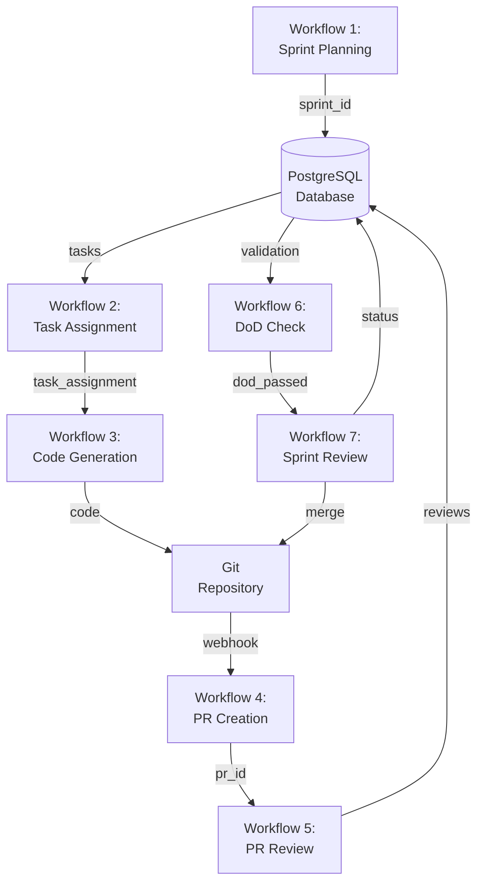

# Council n8n Workflows - Complete Set

Dit document beschrijft alle benodigde n8n workflows voor een werkend Council of LLMs.

## Workflow Architectuur

```
Sprint Planning (Workflow 1)
    ↓
Task Assignment (Workflow 2)
    ↓
Development Loop:
├── Code Generation (Workflow 3a-d, per agent)
├── PR Creation (Workflow 4)
└── PR Review (Workflow 5)
    ├── Boris Security Review
    ├── Linda Test Review
    └── Peer Review
    ↓
Definition of Done Check (Workflow 6)
    ↓
Sprint Review (Workflow 7)
```

## Workflow 1: Sprint Planning

**Trigger**: Manual/Scheduled  
**Agents**: Geert (PO), Saskia (SM)  
**Purpose**: Break down epic into user stories and tasks

### Flow:

1. Geert receives project requirements
2. Geert breaks down into user stories with acceptance criteria
3. Saskia estimates story points
4. Saskia creates sprint backlog
5. Saskia assigns stories to developers
6. Creates entries in `council.sprints` table

### Outputs:

- Sprint record in database
- User stories in database
- Task assignments

---

## Workflow 2: Task Assignment

**Trigger**: Sprint Planning completion  
**Agents**: Saskia → Dev agents  
**Purpose**: Assign specific tasks to developers

### Flow:

1. Read sprint backlog from database
2. Analyze dependencies
3. Assign tasks based on:
   - Agent specialization (Anita=frontend, Johnie=backend, etc.)
   - Dependencies (blocking tasks first)
   - Estimated complexity
4. Create task records with status "assigned"
5. Notify dev agents via webhook

---

## Workflow 3a-d: Code Generation (Per Agent)

**Trigger**: Task assignment webhook  
**Agents**: Anita, Henk, Johnie, Ingrid (individual workflows)  
**Purpose**: Generate code for assigned task

### Flow Example (Johnie):

1. Receive task assignment
2. Query codebase context from vector DB
3. Query similar code patterns
4. Generate code using DeepSeek Coder
5. Validate syntax
6. Create feature branch
7. Commit code
8. Update task status to "in_review"
9. Trigger PR Creation workflow

### Context Gathering:

- Read project README
- Query vector DB for similar functions
- Check existing file structure
- Load relevant dependencies

---

## Workflow 4: PR Creation & Webhook

**Trigger**: Code committed  
**Agents**: Automated  
**Purpose**: Create PR and trigger reviews

### Flow:

1. Detect new branch pushed
2. Create Pull Request
3. Extract PR metadata (files changed, diff)
4. Trigger Workflow 5 (PR Review)
5. Log PR in `council.pull_requests` table

---

## Workflow 5: PR Review Orchestration

**Trigger**: New PR created  
**Agents**: Boris, Linda, Peer Dev (Parallel)  
**Purpose**: Comprehensive code review

### Parallel Branches:

#### Branch 1: Boris Security Review

1. Receive PR diff
2. Analyze for:
   - SQL injection
   - XSS vulnerabilities
   - Authentication issues
   - Sensitive data exposure
   - OWASP Top 10
3. Generate security report
4. Post as PR comment
5. Status: APPROVED / NEEDS_FIXES / CRITICAL

#### Branch 2: Linda Test Review

1. Receive PR code
2. Analyze test coverage
3. Generate missing tests
4. Execute tests (pytest)
5. Browser automation test (if UI changes)
6. Screenshot comparison
7. Post test results as PR comment
8. Status: TESTS_PASS / TESTS_FAIL

#### Branch 3: Peer Review

1. Identify peer reviewer (based on domain)
2. Peer reviews for:
   - Code quality
   - Best practices
   - Readability
   - Architecture fit
3. Post code review comment
4. Status: APPROVED / CHANGES_REQUESTED

### Aggregation:

1. Wait for all 3 reviews
2. Check if all approved
3. If YES → Trigger Workflow 6 (DoD Check)
4. If NO → Notify dev agent, loop back to Workflow 3

---

## Workflow 6: Definition of Done Check

**Trigger**: All reviews approved  
**Agents**: Automated + Thierry (Lead Tech)  
**Purpose**: Verify all DoD criteria met

### Checks:

1. ✅ Code written
2. ✅ Tests written (coverage > 80%)
3. ✅ Tests passing
4. ✅ Security approved
5. ✅ Peer reviewed
6. ✅ Linting passed
7. ✅ Documentation updated
8. ✅ No merge conflicts

### Flow:

1. Run all checks
2. If any fail → Notify dev, back to Workflow 3
3. If all pass → Notify Thierry for final architecture review
4. Thierry approves/rejects
5. If approved → Trigger Workflow 7

---

## Workflow 7: Sprint Review & Merge

**Trigger**: DoD passed  
**Agents**: Saskia, Geert  
**Purpose**: Final acceptance and deployment

### Flow:

1. Saskia aggregates completed stories
2. Geert reviews against acceptance criteria
3. Geert tests feature manually (optional)
4. Geert accepts/rejects
5. If accepted:
   - Merge PR
   - Deploy to staging
   - Update sprint status
   - Close user story
6. If rejected:
   - Add comments
   - Reopen story
   - Back to Workflow 3

---

## Workflow 8: Sprint Retrospective (Bonus)

**Trigger**: End of sprint  
**Agents**: All  
**Purpose**: Learn and improve

### Flow:

1. Query all agent activity from database
2. Calculate metrics:
   - Stories completed
   - Average cycle time
   - Review rejection rate
   - Test failure rate
3. Generate insights using Llama 70B
4. Identify bottlenecks
5. Suggest process improvements
6. Save to next sprint planning

---

## Data Flow Between Workflows



---

## Implementation Priority

### Phase 1: MVP (Single Agent)

1. ✅ Workflow 3a: Johnie Code Generation (DONE - in repo)
2. ✅ Workflow 5 (simplified): Boris + Linda review (DONE - in repo)
3. 🔄 Workflow 6 (simplified): Basic DoD check

### Phase 2: Core Loop

4. Workflow 1: Sprint Planning (Geert + Saskia)
5. Workflow 2: Task Assignment
6. Workflow 4: PR Creation
7. Full Workflow 5: Parallel reviews
8. Full Workflow 6: Complete DoD

### Phase 3: Full Council

9. Workflow 3b-d: All dev agents
10. Workflow 7: Sprint Review & Merge
11. Workflow 8: Retrospective

---

## Technical Requirements

### n8n Nodes Needed:

- HTTP Request (Ollama API calls)
- PostgreSQL (Database operations)
- Code (JavaScript for logic)
- Webhook (Triggers)
- Split in Batches (Parallel processing)
- If/Switch (Conditional logic)
- Merge (Aggregate results)
- Execute Command (Run tests, git commands)

### Database Tables Required:

- `council.sprints`
- `council.agent_activity`
- `council.pull_requests`
- `council.code_embeddings`
- `council.agent_metrics`

### External Integrations:

- Ollama (LLM inference)
- Git (Code versioning)
- Browser automation (Playwright/Puppeteer for Linda)
- Vector DB (pgvector for context)

---

## Next Steps

1. Build Workflow 1 (Sprint Planning)
2. Build Workflow 2 (Task Assignment)
3. Enhance existing Workflow 3 (add context gathering)
4. Build Workflow 4 (PR automation)
5. Enhance Workflow 5 (add peer review)
6. Build Workflow 6 (DoD validation)
7. Build Workflow 7 (Sprint review)
8. Test full cycle end-to-end
9. Iterate based on results
10. Document learnings

---

**Status**: Design Complete, Ready for Implementation  
**Estimated Work**: 8-12 hours for all workflows  
**Testing Time**: 4-6 hours per sprint
