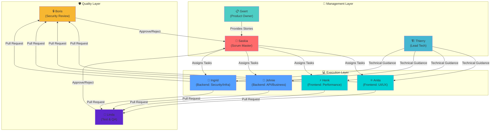
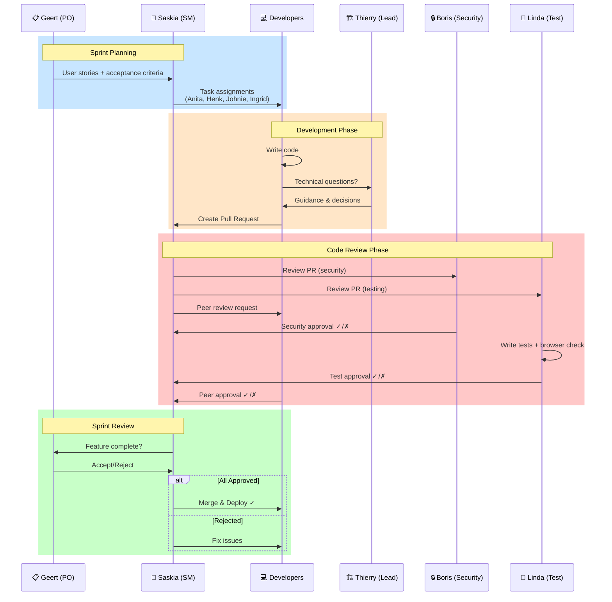
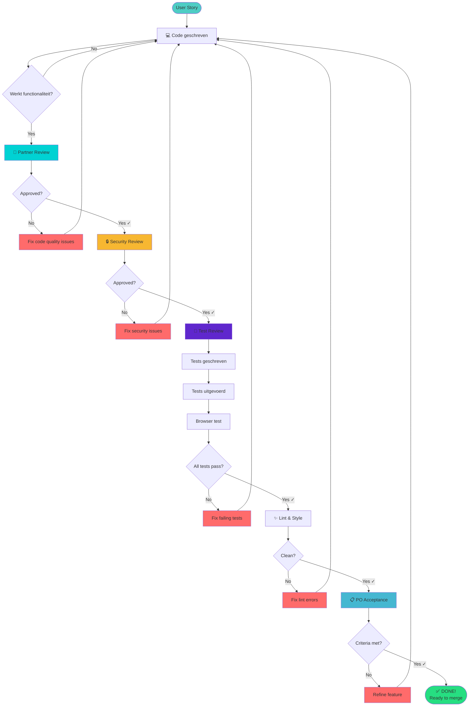
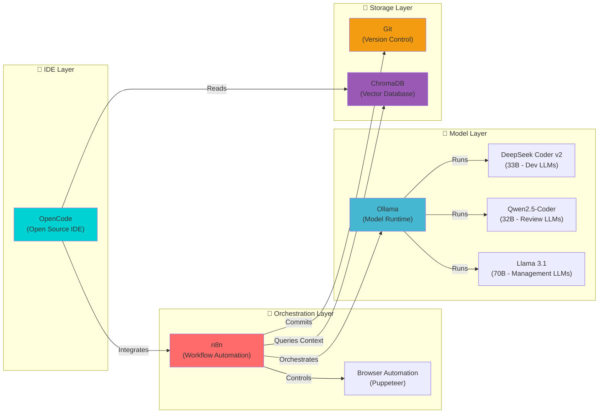
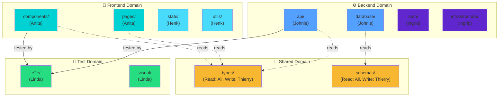
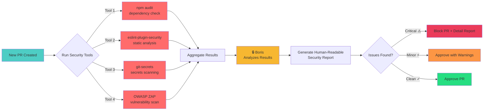
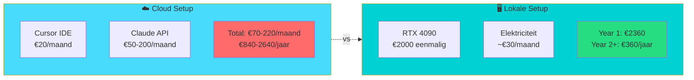
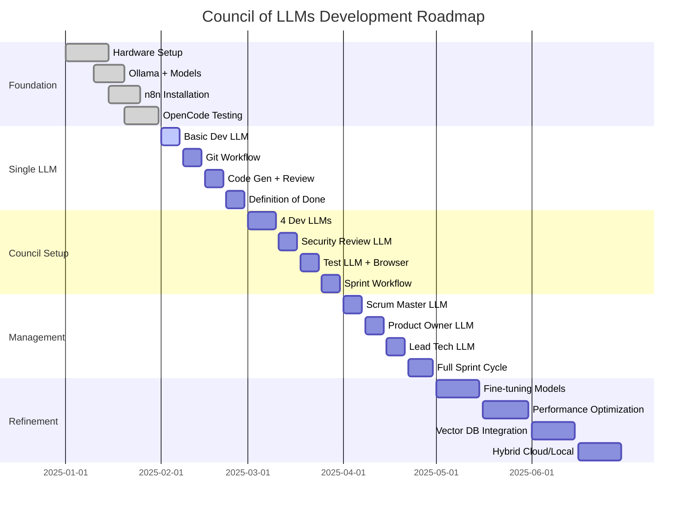

# Van Cloud naar Lokaal: Een Council of LLMs voor Development

De afgelopen maanden heb ik intensief gewerkt met cloud-based AI development tools zoals Cursor met Claude. En eerlijk? Ik ben er super blij mee. De kwaliteit, snelheid en integratie zijn fantastisch. Maar er zit een addertje onder het gras: vendor lock-in, privacy concerns bij gevoelige projecten, en de vraag: _kan dit ook anders?_

Tijd voor een experiment: een volledig lokale AI development omgeving, waarin niet één maar een heel _team_ van gespecialiseerde LLMs samenwerkt aan software development. Welkom bij mijn 'Council of LLMs' - een groep AI-agents die in sprints werken, elkaar reviewen, en samen code produceren.

<!--truncate-->

## Waarom Lokaal? We Hebben Toch Cloud?

Laat ik voorop stellen: cloud-based AI tools zijn geweldig. Cursor met Claude Sonnet heeft me enorm geholpen, en ik blijf het gebruiken voor veel projecten. Maar er zijn goede redenen om ook lokaal te experimenteren:

### De Cloud Voordelen (Die We Behouden Willen)

- **Kwaliteit**: Claude Sonnet 3.5/4 is _extreem_ goed in code generatie
- **Snelheid**: No setup, gewoon werken
- **Updates**: Altijd de nieuwste modellen zonder gedoe
- **Integratie**: Perfect geïntegreerd in de IDE

### Maar Ook Nadelen

- **Privacy**: Bij gevoelige overheidsprojecten of bedrijfscode is "naar de cloud" niet altijd mogelijk[^1]
- **Vendor Lock-in**: Afhankelijk van één provider (Anthropic/OpenAI)
- **Kosten**: Bij intensief gebruik lopen de API calls op
- **Controle**: Geen invloed op model gedrag of specialisatie
- **Offline**: Geen internet = geen AI

### De Lokale Propositie

Wat als we het beste van beide werelden kunnen combineren? Cloud waar het kan, lokaal waar het moet. En wat als we lokaal niet één LLM gebruiken, maar een heel _team_ van gespecialiseerde modellen die samenwerken?

## De Tooling: Open Source Stack

Dit experiment is volledig gebouwd op open source tooling. Hier zijn de belangrijkste componenten:

<div style={{display: 'flex', gap: '20px', flexWrap: 'wrap', marginBottom: '30px', alignItems: 'center'}}>
  
  
  
  
</div>

**Stack overzicht:**

- **n8n**: Workflow orchestration - het zenuwstelsel van ons systeem
- **Ollama**: Local LLM runtime - draait de modellen
- **DeepSeek Coder / Qwen / Llama**: De LLM modellen zelf
- **OpenCode**: Open source IDE met LLM integratie
- **ChromaDB**: Vector database voor code embeddings en context
- **Git**: Version control en samenwerking
- **Playwright/Puppeteer**: Browser automation voor testing

## Het Concept: Council of LLMs

Hier is mijn experiment: in plaats van één generalist LLM, creëer ik een _council_ - een groep gespecialiseerde AI agents die elk een rol hebben in het development proces, vergelijkbaar met een echt dev team.

### De Team Structuur



#### Execution Layer: De Developers (4 LLMs)

**2x Frontend LLMs** - elk met een net iets ander karakter:

- **Anita (Frontend Alpha)**: Focus op UI/UX, toegankelijkheid, gebruikerservaring
  - Context: React best practices, design systems, WCAG richtlijnen
  - Karakter: Perfectionistisch op detail, denkt vanuit de gebruiker
- **Henk (Frontend Beta)**: Focus op performance, state management, architectuur
  - Context: Performance patterns, bundle optimization, advanced React
  - Karakter: Technisch, optimalisatie-gedreven

**2x Backend LLMs** - ook met specialisaties:

- **Johnie (Backend Alpha)**: Focus op API design, database modeling, business logic
  - Context: REST/GraphQL patterns, database normalisatie, domain modeling
  - Karakter: Architecturaal, denkt in systemen
- **Ingrid (Backend Beta)**: Focus op security, performance, infrastructure
  - Context: Security patterns, caching strategies, scalability
  - Karakter: Paranoia (op een goede manier), performance-minded

#### Management Layer: De Coordinators (3 LLMs)

**Thierry (Lead Tech)**: De technische vraagbaak en architect

- Beantwoordt technische vragen van Anita, Henk, Johnie en Ingrid
- Maakt architecturale beslissingen
- Lost technische blokkades op
- Context: Breed, alle tech stacks en patterns

**Geert (Product Owner)**: De strategische richting

- Bepaalt feature prioriteit
- Schrijft user stories en acceptance criteria
- Bewaakt de product visie
- Context: Product management, user needs, business value

**Saskia (Scrum Master)**: De dirigent van het orkest

- Stuurt de sprint aan
- Verdeelt werk over Anita, Henk, Johnie en Ingrid
- Bewaakt Definition of Done
- Zorgt voor samenwerking
- Context: Agile methodologie, team management

#### Quality Layer: De Gatekeepers (2 LLMs)

**Boris (Security Review)**: De paranoia-agent

- Reviewed alle code op security issues
- Checkt OWASP Top 10, injection attacks, auth flows
- Moet elke PR goedkeuren
- Context: Security best practices, CVE databases, threat modeling

**Linda (Test & QA)**: De quality guardian

- Schrijft en runt tests
- Doet visuele browser testing
- Moet elke PR goedkeuren
- Context: Testing strategies, E2E testing, visual regression
- **Special ability**: Heeft toegang tot een browser om functionaliteit daadwerkelijk te testen

### Hoe Ze Samenwerken: Sprint-Based Development

Het idee is om te werken in **sprints** - afgebakende werkpakketten met een duidelijk doel:



**Sprint flow in detail:**

```
1. Sprint Planning
   └─> Geert (Product Owner): Definieert features en acceptance criteria
   └─> Saskia (Scrum Master): Breekt af in taken, wijst toe aan developers

2. Development
   └─> Anita, Henk, Johnie, Ingrid: Werken parallel aan toegewezen taken
   └─> Thierry (Lead Tech): Ondersteunt bij blokkades
   └─> Code wordt gecommit als feature branches

3. Code Review
   └─> Partner Review: Anita reviews Henk en vice versa, Johnie reviews Ingrid
   └─> Boris (Security): Checkt alle PRs op security
   └─> Linda (Test): Schrijft tests, test in browser
   └─> Alle drie moeten goedkeuren voor merge

4. Sprint Review
   └─> Saskia: Evalueert wat af is
   └─> Geert: Accepteert of wijst af
   └─> Team: Retrospective input voor volgende sprint

5. Deploy
   └─> Als Definition of Done is bereikt: merge en deploy
```

### Definition of Done

Elke story is pas "done" als:



**Checklist detail:**

- ✅ Code is geschreven en werkt
- ✅ Partner developer heeft gereviewd en goedgekeurd (Anita ↔ Henk, Johnie ↔ Ingrid)
- ✅ Boris (Security) heeft gereviewd en goedgekeurd
- ✅ Linda (Test) heeft tests geschreven en in browser getest
- ✅ Code voldoet aan style guide en lint regels
- ✅ Acceptance criteria zijn gehaald
- ✅ Geert (Product Owner) heeft geaccepteerd

## De Tech Stack: Open Source All The Way

Voor dit experiment kies ik bewust voor open source tooling, passend bij mijn overtuiging dat open source cruciaal is voor digital soevereiniteit[^2]:



### OpenCode: De IDE

In plaats van Cursor (closed source, cloud-dependent) gebruik ik **OpenCode** - een open source code editor met lokale LLM integratie. Het biedt:

- Native LLM support voor lokale modellen
- Code completion en generation
- Multi-agent support (cruciaal voor ons council concept)
- Full controle over model gedrag en prompts

### n8n: De Orchestrator

**n8n** is een open source workflow automation tool die perfect is voor het orkestreren van onze LLM council[^3]:

- **Visual workflow builder**: Ontwerp de sprint flow visueel
- **LLM integrations**: Native support voor lokale LLMs (Ollama, LM Studio)
- **Git integration**: Commit, branch, PR automation
- **Browser automation**: Voor de Test LLM om visueel te testen
- **State management**: Houdt sprint state bij (taken, status, reviews)
- **Scheduling**: Automatische sprint cycles

#### Voorbeeld n8n Workflow: PR Review Flow


**Workflow uitleg:**

```
[New PR Created]
    ├─> [Trigger] Git webhook
    ├─> [Notify] Security LLM: "Review PR #123"
    │   ├─> [Security LLM analyseert code]
    │   └─> [Output] Security review comment
    ├─> [Notify] Test LLM: "Test PR #123"
    │   ├─> [Test LLM schrijft tests]
    │   ├─> [Test LLM runt browser tests]
    │   └─> [Output] Test results + screenshots
    ├─> [Notify] Partner LLM: "Review PR #123"
    │   ├─> [Partner LLM code review]
    │   └─> [Output] Code review comments
    ├─> [Check] Alle 3 approved?
    │   ├─> [Yes] → Merge PR + Deploy
    │   └─> [No] → Notify developer LLM voor fixes
```

### Lokale LLM Models

Voor de verschillende rollen gebruik ik verschillende **open source modellen** via Ollama:

- **Dev LLMs**: DeepSeek Coder v2 (33B) - excellent voor code generation[^4]
- **Review LLMs**: Qwen2.5-Coder (32B) - goed in code analysis
- **Management LLMs**: Llama 3.1 (70B) - sterke reasoning voor planning
- **Specialisten**: Mix van bovenstaande, plus fine-tuned varianten

**Hardware**: Dit vereist serieuze GPU kracht. Ik werk met een RTX 4090 (24GB VRAM), wat 33B modellen goed aankan. Voor 70B modellen is quantization nodig (Q4/Q5).

## Codebase Structuur: LLM-Safe By Design

Een cruciaal onderdeel is hoe we de codebase structureren zodat LLMs effectief en _veilig_ kunnen werken. Hier komt "LLM-safe" architectuur om de hoek.



### Principe 1: Modulaire Grenzen

Elke agent heeft een **duidelijk afgebakend domein** waar het aan werkt:

```
project/
├── frontend/
│   ├── components/     ← Anita's domein
│   ├── pages/          ← Anita's domein
│   ├── state/          ← Henk's domein
│   └── utils/          ← Henk's domein
├── backend/
│   ├── api/            ← Johnie's domein
│   ├── database/       ← Johnie's domein
│   ├── auth/           ← Ingrid's domein
│   └── infrastructure/ ← Ingrid's domein
└── tests/
    └── e2e/            ← Linda's domein
```

**Waarom?**

- Voorkomt merge conflicts tussen de agents
- Maakt ownership duidelijk
- Limiteert blast radius van fouten

### Principe 2: Context Boundaries

Elke agent krijgt **alleen de context die het nodig heeft**:

```yaml
anita: # Frontend UI/UX
  read_access:
    - frontend/components/**
    - frontend/pages/**
    - shared/types/**
  write_access:
    - frontend/components/**
    - frontend/pages/**

johnie: # Backend API/Business
  read_access:
    - backend/api/**
    - backend/database/**
    - shared/types/**
  write_access:
    - backend/api/**
    - backend/database/**
```

**Waarom?**

- Voorkomt dat agents buiten hun expertise werken
- Reduceert token gebruik (kleinere context)
- Verbetert focus en kwaliteit

### Principe 3: Schema-Driven Development

Gebruik **strikte schemas** als contract tussen LLMs:

```typescript
// shared/types/user.schema.ts
export const UserSchema = z.object({
  id: z.string().uuid(),
  email: z.string().email(),
  role: z.enum(['admin', 'user', 'guest']),
});

export type User = z.infer<typeof UserSchema>;
```

Frontend LLM weet: "Dit is wat backend stuurt"  
Backend LLM weet: "Dit moet ik sturen"  
Beide valideren runtime tegen het schema.

**Waarom?**

- Geen miscommunicatie tussen agents
- Runtime validatie voorkomt bugs
- Duidelijk contract = minder reviews nodig

### Principe 4: Automated Guardrails

Implementeer **automatische checks** die voorkomen dat agents onveilige code schrijven:

```javascript
// .llm-rules.json
{
  "forbidden_patterns": [
    "eval\\(",           // No eval()
    "dangerouslySet",    // No dangerouslySetInnerHTML
    "SELECT \\* FROM",   // No SELECT * queries
    "\\.env",            // No direct .env access
  ],
  "required_patterns": {
    "api/**/*.ts": [
      "input\\.validate", // All API routes must validate input
      "requireAuth"       // All routes must have auth
    ],
    "database/**/*.ts": [
      "prepared"          // All queries must be prepared statements
    ]
  }
}
```

Deze rules worden gecheckt:

1. **Pre-commit**: Git hook checkt of code voldoet
2. **In n8n**: Voor een agent code kan committen
3. **In Security Review**: Boris gebruikt deze rules

**Waarom?**

- Voorkomt common vulnerabilities
- Dwingt best practices af
- Maakt security review efficiënter

### Principe 5: Explicit Dependencies

Maak dependencies **explicieit en locked**:

```json
// package.json
{
  "dependencies": {
    "react": "18.2.0", // Exact version, no ^
    "express": "4.18.2"
  },
  "llm-rules": {
    "allowed_dependencies": ["react", "express", "zod"],
    "forbidden_dependencies": ["eval-*", "*-unsafe", "shell-*"]
  }
}
```

LLMs mogen **niet zomaar dependencies toevoegen** - dat moet via Geert (Product Owner) als bewuste keuze.

**Waarom?**

- Voorkomt supply chain attacks
- Voorkomt dependency hell
- Keeps bundle size in check

## Security: De Paranoia Layer

**Boris (Security Review)** is cruciaal - hij is de laatste verdedigingslinie tegen vulnerabilities. Hoe zorg ik dat Boris effectief is?

### Boris' Context & Prompting

Boris krijgt specialized context:

```
You are a security expert reviewing code for vulnerabilities.
Focus on:
- OWASP Top 10 vulnerabilities
- Input validation and sanitization
- Authentication and authorization flows
- SQL injection, XSS, CSRF
- Secrets management
- Dependency vulnerabilities

For EACH PR, you MUST:
1. Check against forbidden patterns in .llm-rules.json
2. Verify input validation on all API endpoints
3. Check for hardcoded secrets or credentials
4. Verify authentication on protected routes
5. Check SQL queries are parameterized
6. Verify CORS configuration
7. Check dependency versions against CVE databases

Output format:
- [APPROVED] if no issues found
- [REJECTED] with detailed list of issues to fix
```

### Automated Security Scanning Integration

Boris gebruikt ook **geautomatiseerde tools**:



**Tool integratie:**

```
n8n workflow:
[PR Created]
  ├─> Run: npm audit (dependency check)
  ├─> Run: eslint-plugin-security (static analysis)
  ├─> Run: git-secrets (secrets scanning)
  ├─> Aggregate results
  └─> Feed to Boris for analysis + human-readable report
```

Boris interpreteert de tool output en geeft context-aware feedback.

## Testing: De Visual QA Layer

**Linda (Test & QA)** heeft een special ability: **browser toegang** voor visuele testing.

### Linda's Workflow


**Workflow detail:**

```
1. Receive: PR with new feature
2. Analyze: Code changes + feature description
3. Generate:
   - Unit tests (Jest/Vitest)
   - Integration tests (API testing)
   - E2E test specs (Playwright)
4. Execute: Run tests
5. Visual Testing:
   - Launch browser (via n8n browser automation)
   - Navigate feature flow
   - Take screenshots at key points
   - Compare against expected states
   - Check accessibility (WCAG)
6. Report:
   - Test coverage metrics
   - Passing/failing tests
   - Screenshots + visual regression diffs
   - Accessibility violations
```

### n8n Browser Automation

n8n heeft ingebouwde **browser automation** (gebaseerd op Puppeteer):

```
[Test LLM]
  └─> [n8n: Launch Browser Node]
      └─> Navigate to localhost:3000/feature
      └─> Fill form fields
      └─> Click submit button
      └─> Wait for response
      └─> Screenshot result
      └─> Check for error messages
      └─> Validate DOM elements
      └─> Return results to Test LLM
```

Linda kan zelf **test scripts schrijven** in Playwright syntax, die n8n uitvoert.

## Challenges & Realiteit Check

Laten we eerlijk zijn - dit is een experiment, en er zijn challenges:

### Challenge 1: Context Management

**Probleem**: LLMs hebben beperkte context windows. Hoe houden de agents overzicht over een groeiende codebase?

**Oplossing**:

- **Vector database** (ChromaDB) met code embeddings
- Agents querien alleen relevante context voor hun taak
- Semantic search: "find authentication code" → retrieves auth modules

### Challenge 2: Agent Coordination Overhead

**Probleem**: 9 agents coördineren is complex. Wat als ze het niet eens zijn?

**Oplossing**:

- **Saskia (Scrum Master)** heeft final say bij deadlocks
- **Voting system**: Bij conflicts stemmen relevante agents
- **Escalation**: Bij blijvend conflict → human intervention

### Challenge 3: Cost vs. Cloud

**Probleem**: Een RTX 4090 kost €2000+, elektriciteit loopt op.



**Realiteit**:

- Dit is een **experiment en learning exercise**
- Voor productie blijf ik cloud (Cursor/Claude) gebruiken waar het kan
- Lokaal is voor **gevoelige projecten** of **offline scenarios**
- Hybrid approach: cloud voor prototyping, lokaal voor production

### Challenge 4: Model Quality

**Probleem**: Zijn lokale modellen (33B) even goed als Claude Sonnet (175B+)?

**Eerlijk antwoord**: Nee. Claude is superieur in reasoning en code quality.

**Maar**:

- DeepSeek Coder v2 is verrassend goed voor specifieke taken
- Door **specialisatie** (elke agent focust op klein domein) compenseert dit
- Door **peer review** (agents checken elkaar) vang je fouten
- Voor veel taken is "goed genoeg" voldoende

### Challenge 5: Setup Complexiteit

**Probleem**: Dit is _niet_ plug-and-play. Setup is complex.

**Realiteit**:

- Dit is voor **gevorderde users** die willen experimenteren
- Niet bedoeld als vervanging voor Cursor (nog niet)
- De journey is het doel - leren hoe agents samenwerken

## De Roadmap: Iteratief Bouwen

Ik bouw dit stap voor stap:



### Fase 1: Foundation (Januari 2025) ✅

- [x] Hardware: RTX 4090 geïnstalleerd
- [x] Ollama setup met DeepSeek Coder
- [x] n8n geïnstalleerd en geconfigureerd
- [x] OpenCode getest met lokale LLMs

### Fase 2: Single LLM Development (Februari 2025)

- [ ] Eén development agent werkend krijgen met n8n (laten we beginnen met Johnie)
- [ ] Git workflow automation (commit, branch, PR)
- [ ] Basic code generation + review cycle
- [ ] Definition of Done implementeren

### Fase 3: Council Setup (Maart 2025)

- [ ] Alle 4 development agents actief (Anita, Henk, Johnie, Ingrid)
- [ ] Boris (Security) integratie
- [ ] Linda (Test) met browser automation
- [ ] Sprint workflow in n8n

### Fase 4: Management Layer (April 2025)

- [ ] Saskia (Scrum Master) voor coördinatie
- [ ] Geert (Product Owner) voor backlog
- [ ] Thierry (Lead Tech) voor architectuur
- [ ] Volledige sprint cycle

### Fase 5: Refinement (Mei 2025+)

- [ ] Fine-tuning modellen op onze codebase
- [ ] Performance optimalisatie
- [ ] Context management met vector DB
- [ ] Hybrid cloud/local workflows

## Waarom Dit Experiment?

Ten slotte, waarom doe ik dit? Een paar redenen:

### 1. Digital Soevereiniteit

Als ik pleit voor digital soevereiniteit bij overheden[^5], moet ik ook zelf experimenteren met alternatieven voor cloud-afhankelijkheid.

### 2. Leren Hoe LLMs Samenwerken

De toekomst van AI development is waarschijnlijk **niet** één super-intelligent model, maar **teams van gespecialiseerde modellen** die samenwerken. Dit is een kans om die dynamiek te begrijpen.

### 3. Open Source Bijdragen

Door te bouwen met open source (OpenCode, n8n, Ollama), kan ik:

- Bugs vinden en fixen
- Features bijdragen
- De community helpen

### 4. Privacy-Sensitive Projecten

Voor overheidsprojecten waar code niet naar de cloud mag, biedt dit een realistisch alternatief.

### 5. Het Is Gewoon Vet

Eerlijk? Het is gewoon een gaaf experiment. Een council of AI agents die in sprints werken? That's science fiction made real.

## Volg De Reis

Ik ga dit experiment **open delen** via deze blog. Verwacht updates over:

- Setup guides en tutorials
- Successen en (vooral) failures
- Code voorbeelden en n8n workflows
- Performance benchmarks lokaal vs. cloud
- Lessons learned

Wil je meevolgen? Subscribe via RSS of volg me op social media (links in footer).

En als je zelf experimenteert met lokale LLMs of multi-agent systems - **laat het me weten!** Ik ben enorm geïnteresseerd in hoe anderen dit aanpakken.

---

_Dit is het begin van een reis. Een reis naar meer controle, meer privacy, en meer begrip van hoe AI systems kunnen samenwerken. En wie weet - misschien wordt dit ooit een realistisch alternatief voor cloud-based development. Maar eerst: experimenteren, leren, en veel fouten maken._

_Let's build a Council of LLMs._ 🚀

[^1]: **NCSC** - [Cloud Security Guidelines for Government](https://www.ncsc.nl/documenten/publicaties/2019/juni/01/cloud-security-voor-de-overheid)

[^2]: **iBestuur** - [Versterk de digitale soevereiniteit](https://ibestuur.nl/whitepapers/versterk-de-digitale-soevereiniteit)

[^3]: **n8n.io** - [Open source workflow automation](https://n8n.io/)

[^4]: **DeepSeek AI** - [DeepSeek Coder: Open source code generation models](https://github.com/deepseek-ai/DeepSeek-Coder)

[^5]: Zie mijn eerdere blog: [Volwassenheid van Open Source](/blog/volwassenheid-open-source)
