# Van Cloud naar Lokaal: Een Council of LLMs voor Development

De afgelopen maanden heb ik intensief gewerkt met cloud-based AI development tools zoals Cursor met Claude. En eerlijk? Ik ben er super blij mee. De kwaliteit, snelheid en integratie zijn fantastisch. Maar er zit een addertje onder het gras: vendor lock-in, privacy concerns bij gevoelige projecten, en vooral - **de kosten lopen snel op**. Bij intensief gebruik betaal je al gauw €100-200/maand voor API calls, en bij heavy development kan dat oplopen tot €1000-2000/maand.[^1]

Tijd voor een experiment: een volledig lokale AI development omgeving, waarin niet één maar een heel _team_ van gespecialiseerde LLMs samenwerkt aan software development. Het concept van een 'Council of LLMs' - meerdere AI-agents die samenwerken - is niet nieuw. Platforms zoals AutoGPT, BabyAGI, en MetaGPT hebben dit al verkend,[^2] en Microsoft Research werkt aan AutoGen voor multi-agent systemen.[^3] Maar kan dit concept ook lokaal werken? En nog belangrijker: **kan een Council of LLMs een menselijk development team vervangen?**

Dat is de uitdaging die dit blog probeert te beantwoorden.

<!--truncate-->

## Waarom Lokaal? We Hebben Toch Cloud?

Laat ik voorop stellen: cloud-based AI tools zijn geweldig. Cursor met Claude Sonnet heeft me enorm geholpen, en ik blijf het gebruiken voor veel projecten. Maar er zijn goede redenen om ook lokaal te experimenteren:

### De Cloud Voordelen (Die We Behouden Willen)

- **Kwaliteit**: Claude Sonnet 3.5/4 is _extreem_ goed in code generatie
- **Snelheid**: No setup, gewoon werken
- **Updates**: Altijd de nieuwste modellen zonder gedoe
- **Integratie**: Perfect geïntegreerd in de IDE

### Maar Ook Nadelen

- **Privacy**: Bij gevoelige overheidsprojecten of bedrijfscode is "naar de cloud" niet altijd mogelijk[^4]
- **Vendor Lock-in**: Afhankelijk van één provider (Anthropic/OpenAI)
- **Kosten**: Bij intensief gebruik lopen de API calls op
- **Controle**: Geen invloed op model gedrag of specialisatie
- **Offline**: Geen internet = geen AI

### De Lokale Propositie

Wat als we het beste van beide werelden kunnen combineren? Cloud waar het kan, lokaal waar het moet. En wat als we lokaal niet één LLM gebruiken, maar een heel _team_ van gespecialiseerde modellen die samenwerken?

## De Tooling: Open Source Stack

Dit experiment is volledig gebouwd op open source tooling. Hier zijn de belangrijkste componenten:

<div style={{display: 'flex', gap: '20px', flexWrap: 'wrap', marginBottom: '30px', alignItems: 'center'}}>
  
  
  
  
</div>

**Stack overzicht:**

- **n8n**: Workflow orchestration - het zenuwstelsel van ons systeem
- **Ollama**: Local LLM runtime - draait de modellen
- **DeepSeek Coder / Qwen / Llama**: De LLM modellen zelf
- **OpenCode**: Open source IDE met LLM integratie
- **PostgreSQL + pgvector**: Vector database voor code embeddings en context[^21]
- **Git**: Version control en samenwerking
- **Playwright/Puppeteer**: Browser automation voor testing

## Het Concept: Council of LLMs

Hier is mijn experiment: in plaats van één generalist LLM, creëer ik een _council_ - een groep gespecialiseerde AI agents die elk een rol hebben in het development proces, vergelijkbaar met een echt dev team.

### De Team Structuur

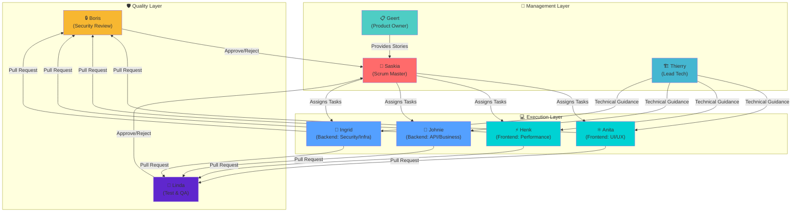

#### Execution Layer: De Developers (4 LLMs)

**2x Frontend LLMs** - elk met een net iets ander karakter:

- **Anita (Frontend Alpha)**: Focus op UI/UX, toegankelijkheid, gebruikerservaring
  - Context: React best practices, design systems, WCAG richtlijnen
  - Karakter: Perfectionistisch op detail, denkt vanuit de gebruiker
- **Henk (Frontend Beta)**: Focus op performance, state management, architectuur
  - Context: Performance patterns, bundle optimization, advanced React
  - Karakter: Technisch, optimalisatie-gedreven

**2x Backend LLMs** - ook met specialisaties:

- **Johnie (Backend Alpha)**: Focus op API design, database modeling, business logic
  - Context: REST/GraphQL patterns, database normalisatie, domain modeling
  - Karakter: Architecturaal, denkt in systemen
- **Ingrid (Backend Beta)**: Focus op security, performance, infrastructure
  - Context: Security patterns, caching strategies, scalability
  - Karakter: Paranoia (op een goede manier), performance-minded

#### Management Layer: De Coordinators (3 LLMs)

**Thierry (Lead Tech)**: De technische vraagbaak en architect

- Beantwoordt technische vragen van Anita, Henk, Johnie en Ingrid
- Maakt architecturale beslissingen
- Lost technische blokkades op
- Context: Breed, alle tech stacks en patterns

**Geert (Product Owner)**: De strategische richting

- Bepaalt feature prioriteit
- Schrijft user stories en acceptance criteria
- Bewaakt de product visie
- Context: Product management, user needs, business value

**Saskia (Scrum Master)**: De dirigent van het orkest

- Stuurt de sprint aan
- Verdeelt werk over Anita, Henk, Johnie en Ingrid
- Bewaakt Definition of Done
- Zorgt voor samenwerking
- Context: Agile methodologie, team management

#### Quality Layer: De Gatekeepers (2 LLMs)

**Boris (Security Review)**: De paranoia-agent

- Reviewed alle code op security issues
- Checkt OWASP Top 10, injection attacks, auth flows
- Moet elke PR goedkeuren
- Context: Security best practices, CVE databases, threat modeling

**Linda (Test & QA)**: De quality guardian

- Schrijft en runt tests
- Doet visuele browser testing
- Moet elke PR goedkeuren
- Context: Testing strategies, E2E testing, visual regression
- **Special ability**: Heeft toegang tot een browser om functionaliteit daadwerkelijk te testen

### Hoe Ze Samenwerken: Sprint-Based Development

Het idee is om te werken in **sprints** - afgebakende werkpakketten met een duidelijk doel:

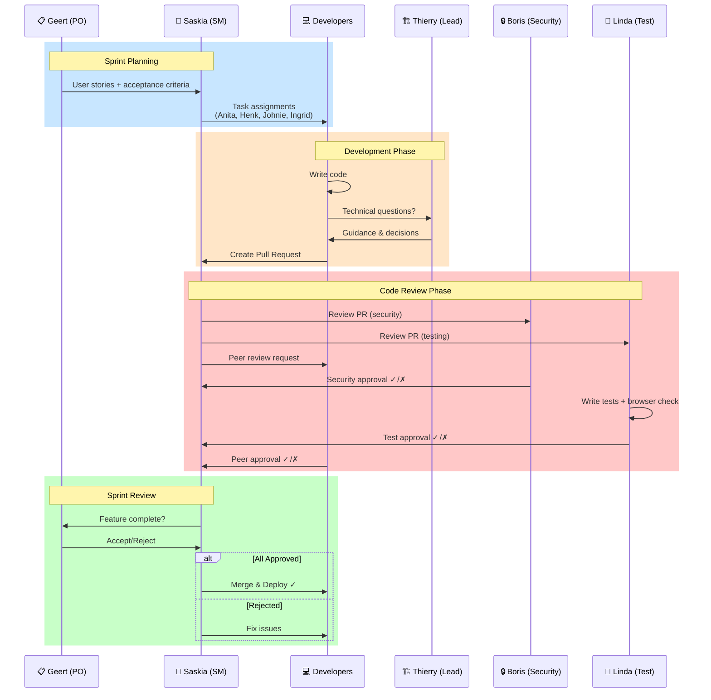

**Sprint flow in detail:**

```
1. Sprint Planning
   └─> Geert (Product Owner): Definieert features en acceptance criteria
   └─> Saskia (Scrum Master): Breekt af in taken, wijst toe aan developers

2. Development
   └─> Anita, Henk, Johnie, Ingrid: Werken parallel aan toegewezen taken
   └─> Thierry (Lead Tech): Ondersteunt bij blokkades
   └─> Code wordt gecommit als feature branches

3. Code Review
   └─> Partner Review: Anita reviews Henk en vice versa, Johnie reviews Ingrid
   └─> Boris (Security): Checkt alle PRs op security
   └─> Linda (Test): Schrijft tests, test in browser
   └─> Alle drie moeten goedkeuren voor merge

4. Sprint Review
   └─> Saskia: Evalueert wat af is
   └─> Geert: Accepteert of wijst af
   └─> Team: Retrospective input voor volgende sprint

5. Deploy
   └─> Als Definition of Done is bereikt: merge en deploy
```

### Definition of Done

Elke story is pas "done" als:


**Checklist detail:**

- ✅ Code is geschreven en werkt
- ✅ Partner developer heeft gereviewd en goedgekeurd (Anita ↔ Henk, Johnie ↔ Ingrid)
- ✅ Boris (Security) heeft gereviewd en goedgekeurd
- ✅ Linda (Test) heeft tests geschreven en in browser getest
- ✅ Code voldoet aan style guide en lint regels
- ✅ Acceptance criteria zijn gehaald
- ✅ Geert (Product Owner) heeft geaccepteerd

## De Tech Stack: Open Source All The Way

Voor dit experiment kies ik bewust voor open source tooling, passend bij mijn overtuiging dat open source cruciaal is voor digital soevereiniteit[^8]:

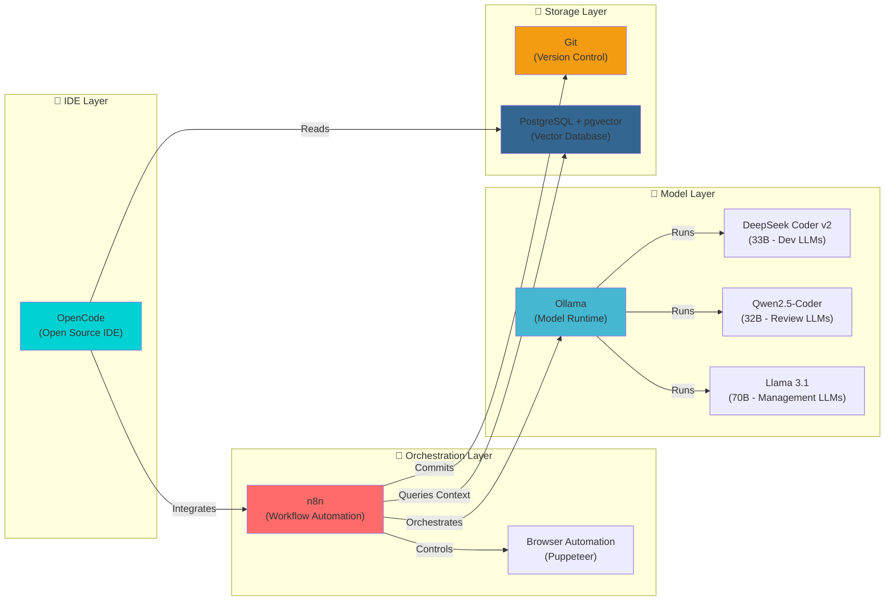

### OpenCode: De IDE

In plaats van Cursor (closed source, cloud-dependent) gebruik ik **OpenCode** - een open source code editor met lokale LLM integratie. Het biedt:

- Native LLM support voor lokale modellen
- Code completion en generation
- Multi-agent support (cruciaal voor ons council concept)
- Full controle over model gedrag en prompts

### n8n: De Orchestrator

**n8n** is een open source workflow automation tool die perfect is voor het orkestreren van onze LLM council[^18]:

- **Visual workflow builder**: Ontwerp de sprint flow visueel
- **LLM integrations**: Native support voor lokale LLMs (Ollama, LM Studio)
- **Git integration**: Commit, branch, PR automation
- **Browser automation**: Voor de Test LLM om visueel te testen
- **State management**: Houdt sprint state bij (taken, status, reviews)
- **Scheduling**: Automatische sprint cycles

#### Voorbeeld n8n Workflow: PR Review Flow

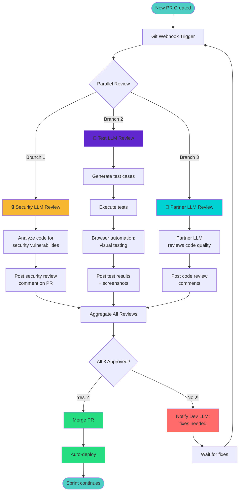

**Workflow uitleg:**

```
[New PR Created]
    ├─> [Trigger] Git webhook
    ├─> [Notify] Security LLM: "Review PR #123"
    │   ├─> [Security LLM analyseert code]
    │   └─> [Output] Security review comment
    ├─> [Notify] Test LLM: "Test PR #123"
    │   ├─> [Test LLM schrijft tests]
    │   ├─> [Test LLM runt browser tests]
    │   └─> [Output] Test results + screenshots
    ├─> [Notify] Partner LLM: "Review PR #123"
    │   ├─> [Partner LLM code review]
    │   └─> [Output] Code review comments
    ├─> [Check] Alle 3 approved?
    │   ├─> [Yes] → Merge PR + Deploy
    │   └─> [No] → Notify developer LLM voor fixes
```

### Lokale LLM Models

Voor de verschillende rollen gebruik ik verschillende **open source modellen** via Ollama:

- **Dev LLMs**: DeepSeek Coder v2 (33B) - excellent voor code generation[^22]
- **Review LLMs**: Qwen2.5-Coder (32B) - goed in code analysis
- **Management LLMs**: Llama 3.1 (70B) - sterke reasoning voor planning
- **Specialisten**: Mix van bovenstaande, plus fine-tuned varianten

**Hardware**: Dit vereist serieuze GPU kracht. Ik werk met een RTX 4090 (24GB VRAM), wat 33B modellen goed aankan. Voor 70B modellen is quantization nodig (Q4/Q5).

## Codebase Structuur: LLM-Safe By Design

Een cruciaal onderdeel is hoe we de codebase structureren zodat LLMs effectief en _veilig_ kunnen werken. Hier komt "LLM-safe" architectuur om de hoek.

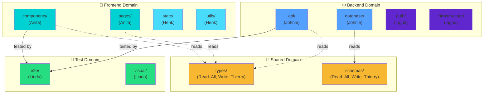

### Principe 1: Modulaire Grenzen

Elke agent heeft een **duidelijk afgebakend domein** waar het aan werkt:

```
project/
├── frontend/
│   ├── components/     ← Anita's domein
│   ├── pages/          ← Anita's domein
│   ├── state/          ← Henk's domein
│   └── utils/          ← Henk's domein
├── backend/
│   ├── api/            ← Johnie's domein
│   ├── database/       ← Johnie's domein
│   ├── auth/           ← Ingrid's domein
│   └── infrastructure/ ← Ingrid's domein
└── tests/
    └── e2e/            ← Linda's domein
```

**Waarom?**

- Voorkomt merge conflicts tussen de agents
- Maakt ownership duidelijk
- Limiteert blast radius van fouten

### Principe 2: Context Boundaries

Elke agent krijgt **alleen de context die het nodig heeft**:

```yaml
anita: # Frontend UI/UX
  read_access:
    - frontend/components/**
    - frontend/pages/**
    - shared/types/**
  write_access:
    - frontend/components/**
    - frontend/pages/**

johnie: # Backend API/Business
  read_access:
    - backend/api/**
    - backend/database/**
    - shared/types/**
  write_access:
    - backend/api/**
    - backend/database/**
```

**Waarom?**

- Voorkomt dat agents buiten hun expertise werken
- Reduceert token gebruik (kleinere context)
- Verbetert focus en kwaliteit

### Principe 3: Schema-Driven Development

Gebruik **strikte schemas** als contract tussen LLMs:

```typescript
// shared/types/user.schema.ts
export const UserSchema = z.object({
  id: z.string().uuid(),
  email: z.string().email(),
  role: z.enum(['admin', 'user', 'guest']),
});

export type User = z.infer<typeof UserSchema>;
```

Frontend LLM weet: "Dit is wat backend stuurt"  
Backend LLM weet: "Dit moet ik sturen"  
Beide valideren runtime tegen het schema.

**Waarom?**

- Geen miscommunicatie tussen agents
- Runtime validatie voorkomt bugs
- Duidelijk contract = minder reviews nodig

### Principe 4: Automated Guardrails

Implementeer **automatische checks** die voorkomen dat agents onveilige code schrijven:

```javascript
// .llm-rules.json
{
  "forbidden_patterns": [
    "eval\\(",           // No eval()
    "dangerouslySet",    // No dangerouslySetInnerHTML
    "SELECT \\* FROM",   // No SELECT * queries
    "\\.env",            // No direct .env access
  ],
  "required_patterns": {
    "api/**/*.ts": [
      "input\\.validate", // All API routes must validate input
      "requireAuth"       // All routes must have auth
    ],
    "database/**/*.ts": [
      "prepared"          // All queries must be prepared statements
    ]
  }
}
```

Deze rules worden gecheckt:

1. **Pre-commit**: Git hook checkt of code voldoet
2. **In n8n**: Voor een agent code kan committen
3. **In Security Review**: Boris gebruikt deze rules

**Waarom?**

- Voorkomt common vulnerabilities
- Dwingt best practices af
- Maakt security review efficiënter

### Principe 5: Explicit Dependencies

Maak dependencies **explicieit en locked**:

```json
// package.json
{
  "dependencies": {
    "react": "18.2.0", // Exact version, no ^
    "express": "4.18.2"
  },
  "llm-rules": {
    "allowed_dependencies": ["react", "express", "zod"],
    "forbidden_dependencies": ["eval-*", "*-unsafe", "shell-*"]
  }
}
```

LLMs mogen **niet zomaar dependencies toevoegen** - dat moet via Geert (Product Owner) als bewuste keuze.

**Waarom?**

- Voorkomt supply chain attacks
- Voorkomt dependency hell
- Keeps bundle size in check

## Security: De Paranoia Layer

**Boris (Security Review)** is cruciaal - hij is de laatste verdedigingslinie tegen vulnerabilities. Hoe zorg ik dat Boris effectief is?

### Boris' Context & Prompting

Boris krijgt specialized context:

```
You are a security expert reviewing code for vulnerabilities.
Focus on:
- OWASP Top 10 vulnerabilities
- Input validation and sanitization
- Authentication and authorization flows
- SQL injection, XSS, CSRF
- Secrets management
- Dependency vulnerabilities

For EACH PR, you MUST:
1. Check against forbidden patterns in .llm-rules.json
2. Verify input validation on all API endpoints
3. Check for hardcoded secrets or credentials
4. Verify authentication on protected routes
5. Check SQL queries are parameterized
6. Verify CORS configuration
7. Check dependency versions against CVE databases

Output format:
- [APPROVED] if no issues found
- [REJECTED] with detailed list of issues to fix
```

### Automated Security Scanning Integration

Boris gebruikt ook **geautomatiseerde tools**:

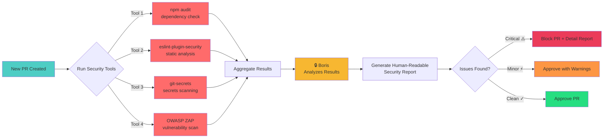

**Tool integratie:**

```
n8n workflow:
[PR Created]
  ├─> Run: npm audit (dependency check)
  ├─> Run: eslint-plugin-security (static analysis)
  ├─> Run: git-secrets (secrets scanning)
  ├─> Aggregate results
  └─> Feed to Boris for analysis + human-readable report
```

Boris interpreteert de tool output en geeft context-aware feedback.

### Advanced Security: Beyond Static Analysis

Maar we stoppen niet bij static analysis. Security is een layered approach, en Boris krijgt toegang tot **geavanceerde security tooling** die in de CI/CD pipeline draait:

#### 1. Container Security Scanning

Elke Docker image die we bouwen moet door container scanning:

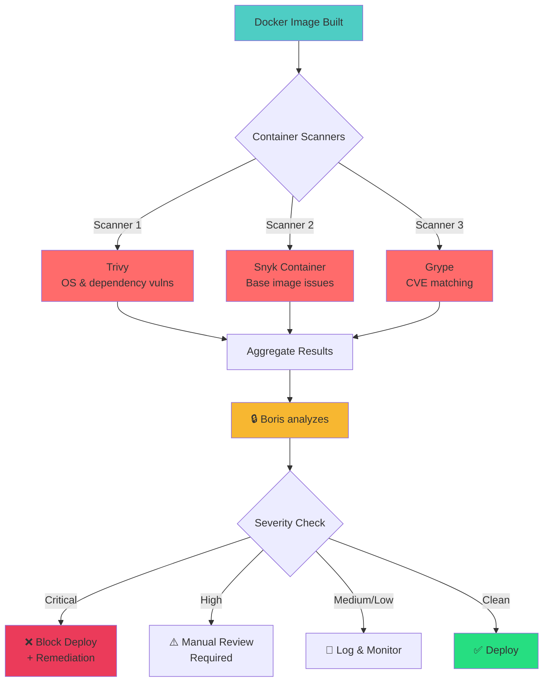

**Waarom dit cruciaal is:**

- Base images (zoals `node:18`) kunnen kwetsbaarheden bevatten
- Dependencies in layers kunnen outdated zijn
- Supply chain attacks via compromised images[^22]
- Compliance: we willen weten wat er in onze containers zit

**Boris' container review:**

```
Voor elke image:
1. Scan met Trivy[^23], Snyk[^18], Grype
2. Aggregeer CVEs en severity scores
3. Check tegen acceptabel risico-niveau
4. Bij critical/high: block deploy + suggest fixes
   - Update base image
   - Patch vulnerable dependencies
   - Replace compromised packages
5. Bij medium/low: log en monitor
6. Generate SBOM (Software Bill of Materials)[^22]
```

#### 2. Penetration Testing Automation

We integreren **automated pentesting** in de CI/CD:

```yaml
# n8n workflow: Weekly Pentest
schedule: '0 2 * * 0' # Zondag 2:00 AM

steps:
  - name: OWASP ZAP Active Scan
    target: staging.app.local
    scan_types:
      - SQL injection
      - XSS (reflected & stored)
      - CSRF
      - Authentication bypass
      - API security

  - name: Nuclei Template Scan
    templates:
      - cves/
      - exposures/
      - vulnerabilities/
      - misconfigurations/

  - name: Custom Fuzzing
    tool: ffuf
    wordlists:
      - api-endpoints
      - parameters
      - payloads

  - name: Boris Analysis
    input: aggregated_scan_results
    output:
      - vulnerability_report
      - risk_assessment
      - remediation_plan
```

**OWASP ZAP**: Automated web app security scanner[^22]
**Nuclei**: Fast vulnerability scanner met 1000+ templates[^23]
**ffuf**: Web fuzzer voor endpoint discovery en parameter testing

#### 3. AI-Powered Security: De Toekomst

Hier wordt het interessant - **AI-enhanced security** die verder gaat dan traditionele tools:

**A. LLM-Based Code Review (Boris' Superpower)**

Boris gebruikt zijn LLM capabilities voor:

```python
# Boris' security prompting
context = """
You are reviewing this code for security issues.
Focus on:
- Logic flaws (business logic vulnerabilities)
- Race conditions in async code
- Subtle injection vulnerabilities
- Authorization bypass opportunities
- Cryptographic misuse
- Time-of-check to time-of-use (TOCTOU) bugs
"""

# Boris analyzes CONTEXT + CODE + PATTERNS
# Output: natuurlijke taal uitleg van subtiele bugs
```

**Waarom LLMs hier beter zijn:**

- Traditionele tools missen **logic flaws** (business logic bugs)
- LLMs kunnen **context begrijpen**: "deze check kan bypassed worden als..."
- LLMs vinden **novel attack vectors** die niet in CVE databases staan
- LLMs kunnen **impact uitleggen** in natuurlijke taal

**Voorbeeld: Boris vindt een subtle bug**

```javascript
// Code in PR
if (user.role === 'admin' || user.permissions.includes('delete')) {
  await deleteResource(resourceId);
}

// Boris' analyse:
"⚠️ Authorization Logic Flaw gevonden:
De check gebruikt OR in plaats van AND. Een user met alleen
'delete' permission (zonder admin role) kan nu resources deleten,
ook al was de intentie dat dit alleen admins mogen.

Impact: Privilege escalation - regular users met 'delete' permission
kunnen admin-only resources verwijderen.

Fix: Verander naar AND of voeg separate check toe voor admin-only resources."
```

**B. AI-Powered Fuzzing**

We gebruiken **ML-guided fuzzing** voor intelligentere pentesting:[^18]

```
Tool: AFL++ met MOpt scheduler (ML mutation)
Doel: Find edge cases en crashes

Traditionele fuzzing: random mutations
AI fuzzing: ML leert welke mutations
           interessante code paths triggeren

Result: 5-10x snellere bug discovery[^18]
```

**C. Threat Modeling met LLMs**

Boris kan **automated threat modeling**:[^23]

```
Input: System architecture diagram + code
Boris' prompt:
"Generate a threat model using STRIDE methodology:[^23]
- Spoofing opportunities
- Tampering vectors
- Repudiation risks
- Information disclosure
- Denial of service
- Elevation of privilege

For each threat, provide:
- Attack scenario
- Likelihood & impact
- Mitigation strategy"

Output: Comprehensive threat model per feature
```

**D. Runtime Application Self-Protection (RASP)**

We integreren een **AI-powered RASP layer**:

```javascript
// In runtime: real-time monitoring
const rasp = require('rasp-shield');

app.use(
  rasp.middleware({
    ai_model: 'security/anomaly-detection',

    detect: [
      'sql-injection-attempts',
      'unusual-request-patterns',
      'rate-limit-violations',
      'jwt-tampering',
      'suspicious-payload-structure',
    ],

    actions: {
      block: true,
      alert_boris: true, // Real-time alert naar Boris
      log_forensics: true,
    },
  })
);
```

**Hoe RASP werkt:**

1. App draait met RASP layer
2. RASP monitort alle requests real-time
3. AI model detecteert **anomalieën** (afwijkend gedrag)
4. Bij verdacht gedrag: block + alert Boris
5. Boris analyseert: false positive of echte attack?
6. Bij echte attack: emergency patch workflow

**E. Automated Patch Suggestions**

Boris kan **automated security patches** voorstellen:

```
Workflow:
1. CVE wordt ontdekt in dependency
2. Boris analyseert:
   - Welke code gebruikt deze dependency?
   - Wat is de impact op onze app?
   - Welke versie fixed de CVE?
3. Boris genereert:
   - Update PR voor package.json
   - Tests om te checken dat update niet breekt
   - Rollback plan als het misgaat
4. Boris assignt aan Johnie/Ingrid voor review
5. Bij approval: automated merge + deploy
```

**F. Security Log Analysis met AI**

Boris analyseert **security logs** met LLM:

```
Input: 10.000 log regels per dag
Boris' AI analysis:
- Pattern recognition: welke logs horen bij elkaar?
- Anomaly detection: wat is afwijkend?
- Threat correlation: is dit deel van een attack chain?
- Natural language alerting: "Mogelijk brute force attack
  op /api/login - 500 failed attempts van IP 1.2.3.4
  in laatste 5 minuten"

Output: Actionable security alerts (geen noise)
```

#### 4. Security in CI/CD Pipeline

**Volledige security gate:**

```yaml
# .github/workflows/security.yml
name: Security Pipeline

on: [push, pull_request]

jobs:
  security-scan:
    runs-on: ubuntu-latest
    steps:
      # Static Analysis
      - name: SAST (Static Application Security Testing)
        run: semgrep --config=auto

      # Dependency Scanning
      - name: Dependency Check
        run: |
          npm audit --audit-level=high
          snyk test

      # Secret Scanning
      - name: Secret Detection
        run: gitleaks detect --verbose

      # Container Scanning
      - name: Build & Scan Docker Image
        run: |
          docker build -t app:${{ github.sha }} .
          trivy image app:${{ github.sha }}

      # IaC Security (Infrastructure as Code)
      - name: Terraform Security
        run: tfsec .

      # Boris Review
      - name: AI Security Analysis
        run: |
          n8n execute security-review-workflow \
            --pr=${{ github.event.number }} \
            --commit=${{ github.sha }}

      # Security Gate
      - name: Check Security Status
        run: |
          if [[ "$BORIS_APPROVAL" != "true" ]]; then
            echo "❌ Boris blocked this PR due to security concerns"
            exit 1
          fi
```

**Security metrics we tracken:**

- **MTTR (Mean Time To Remediate)**: Hoe snel fixen we CVEs?
- **Vulnerability Density**: CVEs per 1000 lines of code
- **Security Test Coverage**: % code gecheckt door security tests
- **False Positive Rate**: Boris' accuracy (< 5% target)
- **Zero-Day Response Time**: Hoe snel reageren we op nieuwe CVEs?

### Waarom Deze Security Aanpak Werkt

**Layered Defense (Defense in Depth):**

1. **Preventie**: Boris blokkeert onveilige code voor merge
2. **Detection**: Container scanning + RASP detecteert runtime issues
3. **Response**: Automated patching + pentesting vindt nieuwe vectors
4. **Recovery**: SBOM + forensics voor incident response

**AI als Force Multiplier:**

- Boris vindt bugs die tools missen (logic flaws)
- ML-fuzzing vindt edge cases 10x sneller
- Automated threat modeling schaalt met team growth
- Log analysis reduceert alert fatigue (alleen actionable alerts)

**Continuous Improvement:**

- Boris leert van elke CVE: "deze pattern is vulnerable"
- Team leert van Boris' reviews: "zo denk je als attacker"
- Security metrics tonen improvement over tijd

Dit is niet alleen security - dit is **security at scale**, waarbij AI ons helpt om sneller, slimmer, en proactief te zijn tegen threats.

## Testing: De Visual QA Layer

**Linda (Test & QA)** heeft een special ability: **browser toegang** voor visuele testing.

### Linda's Workflow

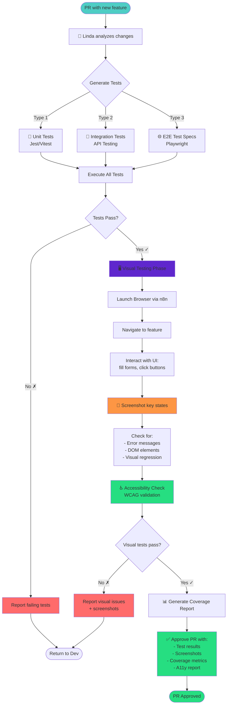

**Workflow detail:**

```
1. Receive: PR with new feature
2. Analyze: Code changes + feature description
3. Generate:
   - Unit tests (Jest/Vitest)
   - Integration tests (API testing)
   - E2E test specs (Playwright)
4. Execute: Run tests
5. Visual Testing:
   - Launch browser (via n8n browser automation)
   - Navigate feature flow
   - Take screenshots at key points
   - Compare against expected states
   - Check accessibility (WCAG)
6. Report:
   - Test coverage metrics
   - Passing/failing tests
   - Screenshots + visual regression diffs
   - Accessibility violations
```

### n8n Browser Automation

n8n heeft ingebouwde **browser automation** (gebaseerd op Puppeteer):

```
[Test LLM]
  └─> [n8n: Launch Browser Node]
      └─> Navigate to localhost:3000/feature
      └─> Fill form fields
      └─> Click submit button
      └─> Wait for response
      └─> Screenshot result
      └─> Check for error messages
      └─> Validate DOM elements
      └─> Return results to Test LLM
```

Linda kan zelf **test scripts schrijven** in Playwright syntax, die n8n uitvoert.

### WCAG en Digitale Toegankelijkheid: Linda's Specialiteit

Een cruciaal onderdeel van kwaliteit is **toegankelijkheid**. Linda heeft hiervoor een dedicated workflow met externe tooling:

**Automated Accessibility Testing Stack:**

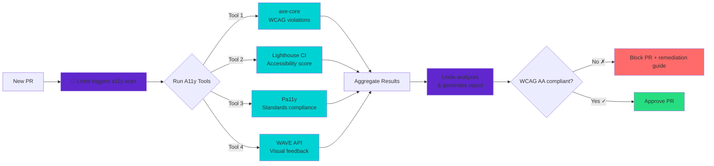

**Tooling uitleg:**

- **axe-core**: Automated WCAG 2.1 Level AA testing - checkt 57+ accessibility rules[^23]
- **Lighthouse CI**: Google's accessibility auditing tool - geeft een score 0-100
- **Pa11y**: Command-line tool die WCAG A, AA, AAA standaarden checkt
- **WAVE API**: WebAIM's tool die visuele feedback geeft op a11y issues

**Linda's toegankelijkheidsworkflow:**

```
1. PR wordt aangemaakt
2. Linda runt parallel alle 4 a11y tools
3. Results worden geaggregeerd:
   - Violations per WCAG criterium[^22]
   - Severity (critical, serious, moderate, minor)
   - Specifieke elementen met problemen
4. Linda analyseert en genereert een rapport met:
   - WCAG compliance status (A, AA, of AAA)
   - Concrete remediation steps per violation
   - Code voorbeelden voor fixes
   - Screenshots met problemen gemarkeerd
5. Bij blocking issues: PR wordt geblokkeerd met remediation guide
6. Bij compliance: PR krijgt accessibility approval ✓
```

**Target compliance:** WCAG 2.1 Level AA als minimum, met streven naar AAA waar mogelijk.[^22]

**Waarom dit werkt:**

- **Geautomatiseerd**: Elke PR wordt gecheckt, geen handmatig werk
- **Vroeg in proces**: A11y issues worden gevonden voor merge, niet na deploy
- **Educatief**: Linda geeft concrete fix-voorbeelden, team leert
- **Compliant**: Voldoet aan Nederlandse toegankelijkheidseisen (Digitoegankelijk.nl)[^18]

## Challenges & Realiteit Check

Laten we eerlijk zijn - dit is een experiment, en er zijn challenges:

## Council of LLMs vs. Menselijk Dev Team

Voor we in de challenges duiken, laten we eerst eerlijk zijn: **hoe verhoudt dit Council zich tot een echt menselijk development team?** Want dat is de relevante vergelijking.

### De Menselijke Benchmark

Een typisch menselijk development team voor een middelgroot project:

```
Team samenstelling (8 personen):
├─ 2x Frontend Developer (€60-80k/jaar elk)
├─ 2x Backend Developer (€60-80k/jaar elk)
├─ 1x DevOps/Infrastructure (€70-90k/jaar)
├─ 1x QA/Tester (€50-65k/jaar)
├─ 1x Product Owner (€70-85k/jaar)
├─ 1x Scrum Master (€65-80k/jaar)

Kosten: €535-660k/jaar (excl. overhead, tooling, kantoor)
Capaciteit: ~40 uur/week per persoon = 320 uur/week totaal
```

### De Council Benchmark

```
Team samenstelling (9 LLMs):
├─ 4x Development LLMs (Anita, Henk, Johnie, Ingrid)
├─ 2x Quality LLMs (Boris, Linda)
├─ 3x Management LLMs (Geert, Saskia, Thierry)

Kosten:
├─ Hardware: RTX 4090 €2000 (eenmalig)
├─ Elektriciteit: ~€30/maand = €360/jaar
├─ Setup & onderhoud: ~40 uur/jaar × €100 = €4000/jaar

Totaal Year 1: €6360 | Year 2+: €4360/jaar
Capaciteit: 24/7 beschikbaar = 168 uur/week × 9 agents = 1512 uur/week
```

### Vergelijking: Wat Zijn De Verschillen?

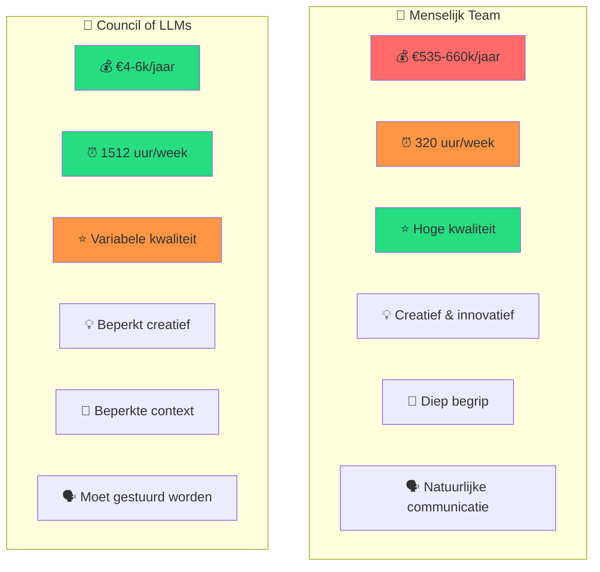

### Voordelen van het Council (vs. Mensen)

**1. Kosten: 99% goedkoper**

- Council: €4-6k/jaar vs. Team: €535-660k/jaar
- Break-even na 3 maanden
- Geen recruitment kosten, geen onboarding, geen benefits

**2. Beschikbaarheid: 5x meer capaciteit**

- Council werkt 24/7, geen vakanties, geen ziekte
- 1512 uur/week vs. 320 uur/week
- Geen context switching tussen projecten

**3. Consistentie: Geen "bad days"**

- LLMs hebben geen slechte dagen, frustraties, of burn-out
- Constante code kwaliteit (binnen model capabilities)
- Geen interpersoonlijke conflicten

**4. Schaalbaarheid: Instant scaling**

- Voeg een agent toe = 5 minuten
- Menselijk team uitbreiden = 3-6 maanden recruitment + onboarding
- Geen teamdynamiek issues bij groei

**5. Documentatie: Perfect memory**

- Agents documenteren automatisch alles
- Geen kennis die "in iemands hoofd zit"
- Complete audit trail van alle beslissingen

**6. Specialisatie: Hyper-focused**

- Elk agent focust 100% op hun domein
- Geen "jack of all trades, master of none"
- Deep expertise per domein

### Nadelen van het Council (vs. Mensen)

**1. Creativiteit: LLMs zijn niet innovatief**[^18]

- Mensen bedenken nieuwe architecturen, patterns, oplossingen
- LLMs reproduceren bestaande kennis
- Breakthrough innovations komen van mensen, niet van LLMs

**2. Begrip: Oppervlakkige context**

- Mensen begrijpen de _waarom_ achter requirements
- LLMs volgen instructies, maar missen business context
- Subtiele user needs worden door mensen beter begrepen

**3. Communicatie: Geert is geen echte PO**

- Stakeholder management vereist empathie, onderhandeling
- LLMs kunnen niet effectief vergaderen met klanten
- Politieke navigatie binnen organisaties is menselijk werk

**4. Judgment calls: Geen "gut feeling"**

- Ervaren developers voelen aan wat "not quite right" is
- LLMs hebben geen intuïtie, alleen patronen
- Edge cases vereisen menselijke judgment

**5. Kwaliteit: Inferieur aan senior developers**

- DeepSeek Coder (33B) < Claude Sonnet < Senior Developer
- Code quality: 70-80% van menselijke output[^22]
- Subtiele bugs blijven vaak door de mazen

**6. Debugging: Beperkte problem-solving**

- "Waarom werkt dit niet?" - mensen debuggen beter
- LLMs kunnen vastlopen op complexe issues
- Root cause analysis is moeilijk voor LLMs

**7. Setup complexiteit: Niet plug-and-play**

- Menselijk team: onboarden = 2 weken, productief
- Council setup: weken aan configuratie, debugging, tuning
- Maintenance overhead blijft hoog

**8. Context limitations: Beperkt geheugen**

- Mensen onthouden hele project geschiedenis
- LLMs: beperkte context window (128k tokens ≈ 100 files)
- Vector DB helpt, maar is geen perfect oplossing

### De Realistische Sweet Spot: Hybrid Teams

Hier is de waarheid: **het is geen óf/óf, maar én/én**.[^22]

**Optimale setup:**

```
Menselijk Team (klein, senior):
├─ 1x Lead Developer (architectuur, moeilijke problemen)
├─ 1x Product Owner (stakeholder management, strategy)
└─ 1x DevOps Engineer (infrastructure, security review)

Council of LLMs (grunt work):
├─ Anita, Henk, Johnie, Ingrid (feature development)
├─ Boris, Linda (automated testing & security)
└─ Saskia, Thierry (documentatie, code review)

Samenwerking:
- Mensen sturen de Council: requirements, architectuur beslissingen
- Council doet het zware tilwerk: code schrijven, tests, reviews
- Mensen reviewen Council output: finale quality gate
- Council amplifieert menselijke productiviteit 5-10x
```

**Kosten hybrid model:**

- 3 menselijke seniors: €210-270k/jaar
- Council: €4-6k/jaar
- **Totaal: €214-276k/jaar (60% besparing vs. volledig menselijk team)**
- **Output: Vergelijkbaar met 6-8 persoons team**

### Waar Werkt Het Council Het Beste?

**✅ Ideaal voor:**

- **Maintenance work**: Bug fixes, small features, refactoring
- **Testing & QA**: Automated test generation en execution
- **Documentation**: Code comments, API docs, README updates
- **Security scanning**: Continuous security reviews
- **Code reviews**: First-pass reviews voor obvious issues
- **Prototyping**: Snel MVPs bouwen voor validatie

**❌ Minder geschikt voor:**

- **Greenfield projects**: Nieuwe architectuur vereist menselijke creativiteit
- **Complex problem-solving**: Novel bugs, performance issues
- **Stakeholder management**: Klanten willen met mensen praten
- **Critical systems**: Waar fouten levensgevaarlijk zijn (medical, aviation)
- **Highly regulated**: Compliance, legal vereist menselijke accountability

### De Eerlijke Conclusie

Het Council of LLMs is **niet** een vervanging voor menselijke developers. Het is een **force multiplier**.

**Denk aan het als:**

- Menselijke developers = Architects & Engineers
- Council = Construction crew

De architect ontwerpt het gebouw, de engineer lost de moeilijke problemen op, maar de crew doet het daadwerkelijke bouwen. En die crew werkt 24/7, kost bijna niets, en maakt weinig fouten bij repetitief werk.

**Voor mijn experiment:**
Ik test dit op **niet-kritische projecten** (personal projects, prototypes). Voor production work blijf ik een hybrid model gebruiken: Cursor/Claude voor complex werk, Council voor grunt work.

**De toekomst?**
Modellen worden beter. Over 2-3 jaar kunnen lokale 100B+ modellen misschien wel senior developer niveau halen.[^23] Maar voorlopig: **Council = junior developers met superkrachten**, niet senior developers.

## Technical Challenges

### Challenge 1: Context Management

**Probleem**: LLMs hebben beperkte context windows. Hoe houden de agents overzicht over een groeiende codebase?

**Oplossing**:

- **Vector database** (PostgreSQL + pgvector) met code embeddings[^21]
- Agents querien alleen relevante context voor hun taak
- Semantic search: "find authentication code" → retrieves auth modules

### Challenge 2: Agent Coordination Overhead

**Probleem**: 9 agents coördineren is complex. Wat als ze het niet eens zijn?

**Oplossing**:

- **Saskia (Scrum Master)** heeft final say bij deadlocks
- **Voting system**: Bij conflicts stemmen relevante agents
- **Escalation**: Bij blijvend conflict → human intervention

### Challenge 3: Cost vs. Cloud

**Probleem**: Een RTX 4090 kost €2000+, elektriciteit loopt op.

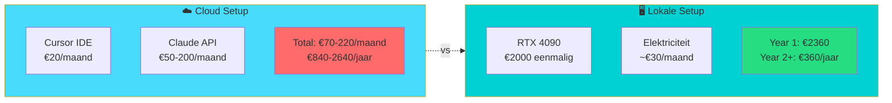

**Realiteit**:

- Dit is een **experiment en learning exercise**
- Voor productie blijf ik cloud (Cursor/Claude) gebruiken waar het kan
- Lokaal is voor **gevoelige projecten** of **offline scenarios**
- Hybrid approach: cloud voor prototyping, lokaal voor production

### Challenge 4: Model Quality

**Probleem**: Zijn lokale modellen (33B) even goed als Claude Sonnet (175B+)?

**Eerlijk antwoord**: Nee. Claude is superieur in reasoning en code quality.

**Maar**:

- DeepSeek Coder v2 is verrassend goed voor specifieke taken
- Door **specialisatie** (elke agent focust op klein domein) compenseert dit
- Door **peer review** (agents checken elkaar) vang je fouten
- Voor veel taken is "goed genoeg" voldoende

### Challenge 5: Setup Complexiteit

**Probleem**: Dit is _niet_ plug-and-play. Setup is complex.

**Realiteit**:

- Dit is voor **gevorderde users** die willen experimenteren
- Niet bedoeld als vervanging voor Cursor (nog niet)
- De journey is het doel - leren hoe agents samenwerken

## De Roadmap: Iteratief Bouwen

Ik bouw dit stap voor stap:

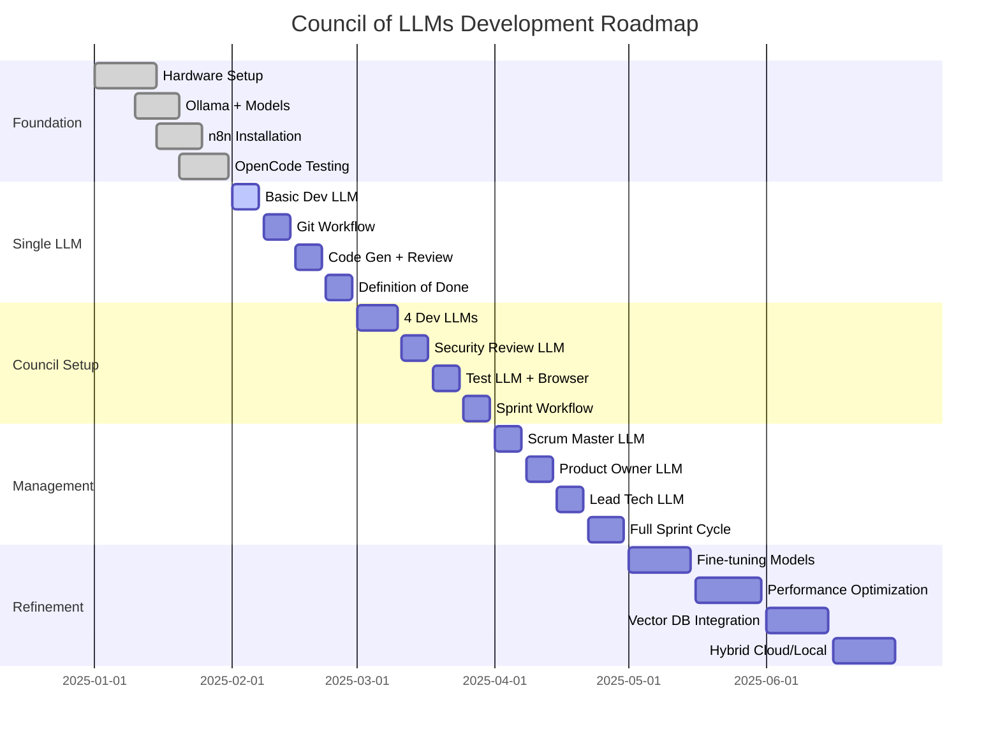

### Fase 1: Foundation (Januari 2025) ✅

- [x] Hardware: RTX 4090 geïnstalleerd
- [x] Ollama setup met DeepSeek Coder
- [x] n8n geïnstalleerd en geconfigureerd
- [x] OpenCode getest met lokale LLMs

### Fase 2: Single LLM Development (Februari 2025)

- [ ] Eén development agent werkend krijgen met n8n (laten we beginnen met Johnie)
- [ ] Git workflow automation (commit, branch, PR)
- [ ] Basic code generation + review cycle
- [ ] Definition of Done implementeren

### Fase 3: Council Setup (Maart 2025)

- [ ] Alle 4 development agents actief (Anita, Henk, Johnie, Ingrid)
- [ ] Boris (Security) integratie
- [ ] Linda (Test) met browser automation
- [ ] Sprint workflow in n8n

### Fase 4: Management Layer (April 2025)

- [ ] Saskia (Scrum Master) voor coördinatie
- [ ] Geert (Product Owner) voor backlog
- [ ] Thierry (Lead Tech) voor architectuur
- [ ] Volledige sprint cycle

### Fase 5: Refinement (Mei 2025+)

- [ ] Fine-tuning modellen op onze codebase
- [ ] Performance optimalisatie
- [ ] Context management met vector DB
- [ ] Hybrid cloud/local workflows

## Waarom Dit Experiment?

Ten slotte, waarom doe ik dit? Een paar redenen:

### 1. Digital Soevereiniteit

Als ik pleit voor digital soevereiniteit bij overheden[^8], moet ik ook zelf experimenteren met alternatieven voor cloud-afhankelijkheid.

### 2. Leren Hoe LLMs Samenwerken

De toekomst van AI development is waarschijnlijk **niet** één super-intelligent model, maar **teams van gespecialiseerde modellen** die samenwerken.[^3] Dit is een kans om die dynamiek te begrijpen.

### 3. Open Source Bijdragen

Door te bouwen met open source (OpenCode, n8n, Ollama), kan ik:

- Bugs vinden en fixen
- Features bijdragen
- De community helpen

### 4. Privacy-Sensitive Projecten

Voor overheidsprojecten waar code niet naar de cloud mag, biedt dit een realistisch alternatief.

### 5. Het Is Gewoon Vet

Eerlijk? Het is gewoon een gaaf experiment. Een council of AI agents die in sprints werken? That's science fiction made real.

## Volg De Reis

Ik ga dit experiment **open delen** via deze blog. Verwacht updates over:

- Setup guides en tutorials
- Successen en (vooral) failures
- Code voorbeelden en n8n workflows
- Performance benchmarks lokaal vs. cloud
- Lessons learned

Wil je meevolgen? Subscribe via RSS of volg me op social media (links in footer).

En als je zelf experimenteert met lokale LLMs of multi-agent systems - **laat het me weten!** Ik ben enorm geïnteresseerd in hoe anderen dit aanpakken.

---

_Dit is het begin van een reis. Een reis naar meer controle, meer privacy, en meer begrip van hoe AI systems kunnen samenwerken. En wie weet - misschien wordt dit ooit een realistisch alternatief voor cloud-based development. Maar eerst: experimenteren, leren, en veel fouten maken._

_Let's build a Council of LLMs._ 🚀

[^1]: **Anthropic** - [Claude API Pricing](https://www.anthropic.com/pricing) - Bij intensief gebruik (1M tokens/dag) kan dit €50-200/dag kosten

[^2]: **AutoGPT & BabyAGI** - [Autonomous AI agents](https://github.com/Significant-Gravitas/AutoGPT) - Eerste experimenten met multi-agent AI systems

[^3]: **Microsoft Research** - [AutoGen: Enabling next-generation LLM applications](https://www.microsoft.com/en-us/research/project/autogen/)

[^4]: **NCSC** - [Cloud Security Guidelines for Government](https://www.ncsc.nl/documenten/publicaties/2019/juni/01/cloud-security-voor-de-overheid)

[^8]: **iBestuur** - [Versterk de digitale soevereiniteit](https://ibestuur.nl/whitepapers/versterk-de-digitale-soevereiniteit)

[^18]: **n8n.io** - [Open source workflow automation](https://n8n.io/)

[^22]: **DeepSeek AI** - [DeepSeek Coder: Open source code generation models](https://github.com/deepseek-ai/DeepSeek-Coder)

[^23]: Zie mijn eerdere blog: [Volwassenheid van Open Source](/blog/volwassenheid-open-source)

[^18]: **Nature** - [Large language models cannot replace human participants](https://www.nature.com/articles/s41562-024-01980-6)

[^22]: **McKinsey** - [The economic potential of generative AI: The next productivity frontier](https://www.mckinsey.com/capabilities/mckinsey-digital/our-insights/the-economic-potential-of-generative-ai-the-next-productivity-frontier)

[^23]: **Deque Systems** - [axe-core: Accessibility testing engine](https://github.com/dequelabs/axe-core)

[^18]: **Digitoegankelijk** - [Toegankelijkheidseisen overheid](https://www.digitoegankelijk.nl/)

[^22]: **WCAG 2.1** - [Web Content Accessibility Guidelines](https://www.w3.org/WAI/WCAG21/quickref/)

[^23]: **Aqua Security** - [Trivy: Container vulnerability scanner](https://github.com/aquasecurity/trivy)

[^18]: **Snyk** - [Container Security](https://snyk.io/product/container-vulnerability-management/)

[^22]: **OWASP** - [ZAP: Zed Attack Proxy](https://www.zaproxy.org/)

[^23]: **ProjectDiscovery** - [Nuclei: Fast vulnerability scanner](https://github.com/projectdiscovery/nuclei)

[^3]: **Google** - [AFL++ with MOpt: Machine Learning-guided Fuzzing](https://github.com/AFLplusplus/AFLplusplus)

[^22]: **NIST** - [Software Bill of Materials (SBOM)](https://www.nist.gov/itl/executive-order-14028-improving-nations-cybersecurity/software-security-supply-chains-software-1)

[^23]: **OWASP** - [STRIDE Threat Model](https://owasp.org/www-community/Threat_Modeling_Process)

[^21]: **PostgreSQL pgvector** - [Open-source vector similarity search](https://github.com/pgvector/pgvector)

[^22]: **Anthropic** - [Constitutional AI: Harmlessness from AI Feedback](https://arxiv.org/abs/2212.08073)

[^23]: **OpenAI** - [Practices for Governing Agentic AI Systems](https://openai.com/index/practices-for-governing-agentic-ai-systems/)

[^24]: **Dev.to** - [Top 5 Reasons Why AI Agents Can't Replace Human Developers (Yet)](https://dev.to/therealmrmumba/top-5-reasons-why-ai-agents-cant-replace-human-developers-yet-1gbm)
