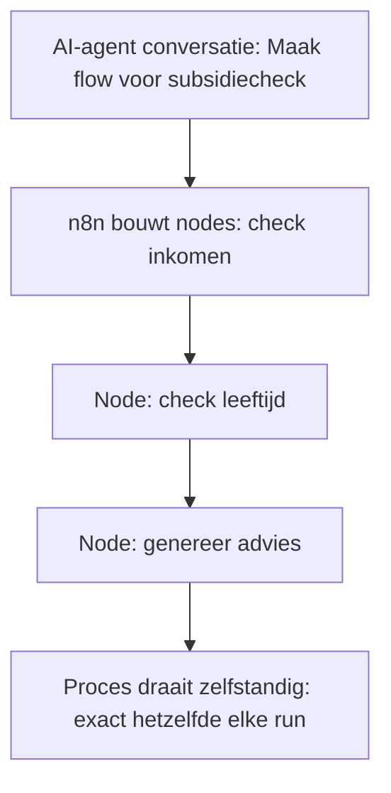

# AI en Techniek: Veilige integratie

:::info Platform AI en Overheid
Deze blog is geschreven in het kader van [Platform AI en Overheid](https://www.platformaienoverheid.nl/), een initiatief gericht op verantwoorde AI-adoptie binnen de publieke sector.
:::

AI-integratie in overheidsapplicaties brengt unieke uitdagingen met zich mee – hoe zorg je dat AI veilig toegang krijgt tot data, zonder risico's op lekken of foute adviezen? Dit blog legt in leken taal uit hoe AI werkt met reasoning, hoe data veilig opgehaald wordt met vectorisatie, en hoe tools als MCP context bieden. We verkennen workflow engines voor business logica, met focus op waarom AI niet voor uitvoering is (te onvoorspelbaar), maar wel voor setup en advies. Met een verbinding naar regels.overheid.nl. Voor praktische handelingskaders en toepassing, zie ons blog "AI en Praktijk: Handelingskaders en toepassing".

<!--truncate-->

## Hoe AI Werkt: Reasoning in Leken Taal

Laten we beginnen bij de basis: hoe "werkt" AI eigenlijk? In eenvoudige termen is AI als een superslimme assistent die patronen herkent en voorspellingen doet op basis van data. Maar het echte "denken" gebeurt via reasoning – een stap-voor-stap proces dat lijkt op hoe een mens redeneert, maar dan razendsnel en met enorme hoeveelheden info. Stel, je vraagt een AI om een subsidie te beoordelen. Het breekt de vraag op: eerst begrijpt het de input (jouw situatie), dan "redeneert" het door mogelijke regels te chainen (stap 1: check leeftijd, stap 2: inkomen, stap 3: regio). Dit heet "chain of thought" reasoning – de AI bouwt een ketting van gedachten, vaak met threading (meerdere parallelle denkpaden om opties te verkennen). Door deze parallelle gedachten en het samenvatten van uitkomsten, denkt AI eigenlijk als een team in plaats van als persoon – verschillende "ideeën" worden bekeken en gecombineerd tot een coherent antwoord.[^1]

Neem een anekdote: een gemeente-ambtenaar gebruikt AI voor een toeslagvraag. De AI "redeneert": "Burger is 35, alleenstaand, inkomen onder drempel – check regel X uit wet Y." Het resultaat? Snelle, traceerbare adviezen. Maar zonder goede data is dit nutteloos – wat ons brengt bij de brug naar de datalaag.

## Hallucineren: Wat Het Is, Waarom Het Gebeurt, Hoe Te Mitigeren

Een veelvoorkomend probleem bij AI is hallucineren – de AI "verzint" feiten die niet kloppen. Wat is het precies? Hallucineren gebeurt wanneer AI plausibele maar onjuiste informatie genereert, omdat het probabilistisch werkt: het voorspelt volgende woorden op basis van patronen in trainingsdata, niet op feiten. Waarom? Door gaps in data, ambiguïteit in queries, of overgeneraliserende modellen. Voorbeeld: vraag "wie won WK 2026?", AI "hallucineert" een winnaar als data stoppen bij 2025.[^2]

Hoe mitigeren? Gebruik RAG (Retrieval-Augmented Generation): haal actuele data op en voed het aan AI, zodat het baseert op feiten. Of chain of thought: dwing stap-voor-stap redenering. In overheid: koppel aan betrouwbare bronnen als regels.overheid.nl – minder risico's op foute adviezen.[^3]

## De Brug naar de Datalaag: Data Ophalen en Vectorisatie

AI is niks zonder data – het is als een auto zonder benzine. In overheidscontext haal je data op uit bronnen zoals Common Ground-registers (BRP voor persoonsgegevens, BAG voor adressen). Dit gebeurt via API's: korte, veilige queries die alleen nodige info ophalen – geen hele database, maar "short range" opvragingen voor snelheid en privacy.[^4]

Om AI slim te maken, gebruik je vectorisatie: data omzetten in wiskundige vectors (getallenreeksen) die patronen makkelijk herkennen. Concreet: een vector representatie van tekst is een lijst getallen die de betekenis vastlegt – "kat" wordt bijv. [0.2, 0.8, -0.1, ...], "poes" iets vergelijkbaars. Waarom beter dan woordvergelijking? Bij woorden match je exact ("kat" ≠ "poes"), bij vectors meet je afstand – semantically similar teksten liggen dichtbij, dus vind je "kat" bij zoektocht naar "huisdier", zelfs zonder exacte woorden. Dit geeft betere, contextuele resultaten.[^5] Voor details over de datalaag, zie ons blog "AI en Data: Waarom de datalaag alles bepaalt". Hier focussen we op integratie: haal data veilig op, vectoriseer voor AI-redenering, en koppel terug aan applicaties.[^6]

## Waarschijnlijkheid vs Zekerheid: AI's Onvoorspelbaarheid tegenover DMN's Rigiditeit

AI is probabilistisch: het berekent waarschijnlijkheden, dus nooit exact dezelfde uitkomst – kleine variaties in input of model leiden tot verschillen, ideaal voor creatieve taken maar riskant voor consistentie.[^7] DMN-engines daarentegen zijn deterministisch: altijd dezelfde uitkomst bij dezelfde input, rigid op kaders – perfect voor regelgeving waar zekerheid cruciaal is, maar minder flexibel voor nuances.[^8]

In overheid: gebruik AI voor exploratie (advies), DMN voor uitvoering (besluiten) – balans tussen innovatie en betrouwbaarheid.[^9]

## AI Integreren met Bestaande Applicaties: MCP als Sleutel

Nu de integratie: hoe koppel je AI aan bestaande overheidsapps zonder chaos? Hier komt het Model Context Protocol (MCP) om de hoek – een standaard die AI veilig context geeft.[^10] MCP is als een portier: het laat AI alleen zien wat nodig is, via gecontroleerde API's. Verschil met gewone API? API's halen data op, MCP voegt context toe – "niet alleen data, maar waarom en hoe het gebruikt mag worden". Bijvoorbeeld: AI krijgt via MCP alleen geanonimiseerde info voor een advies, geen volledige dossiers.[^11]

MCP werkt met drie principes: alleen noodzakelijke context (geen hele database, maar specifieke datapunten via API's), geen vrije toegang (AI roept niet zelf systemen aan, applicatie controleert), API-gedreven (input valideren, output checken, acties loggen). Dit voorkomt misbruik, houdt alles traceerbaar. De standaard, ontwikkeld door Anthropic, is open en evolueert – zie hun documentatie voor details.[^12]

In praktijk: MCP maakt AI "context-aware" – veilig, efficiënt, compliant met AVG (GDPR), EU AI Act en AWB (Algemene wet bestuursrecht).[^13][^14][^15]

## Het Verschil Tussen Data (RAG), Tools (MCP) en Context (OpenSkills.io)

Om integratie te begrijpen, onderscheid data, tools en context. RAG (Retrieval-Augmented Generation) focust op data: haal relevante info op uit bronnen om AI te "gronden" – voorkomt hallucinaties door feiten toe te voegen.[^16] MCP richt op tools: standaardiseert hoe AI met externe systemen praat, zoals API's voor acties.[^17] OpenSkills.io biedt context: een framework voor skills en kennis, zoals profielen of domein-specifieke info, om AI "vaardigheden" te geven.[^18]

Samen: RAG voor feiten, MCP voor interactie, OpenSkills voor vaardigheden – complete integratie.[^19]

## Workflow Engines: Snel Business Logica Uitvoeren met n8n

AI schittert in workflow engines – tools die processen automatiseren. Neem n8n, een open source engine voor snelle business logica. Hier kun je met een AI-agent, via n8n's MCP, conversatief een business logica proces opzetten: praat met de agent ("Maak een flow voor subsidiechecks: check inkomen, dan leeftijd, dan advies"), agent bouwt nodes (stapjes) – geen nodes die zelf weer AI zijn, maar eenvoudige acties zoals data ophalen of notificeren. Eenmaal opgezet, draait het zelfstandig, elke keer exact hetzelfde, zonder verdere AI-input – deterministic en betrouwbaar.[^20]

n8n voert logica uit als een orkestdirigent – efficiënt, schaalbaar.[^21]

## DMN Engines voor Complexe Processen: De Open Source Opvolger van Camunda

Voor complexe processen, zoals zaakafhandeling met beoordelingskaders en menselijk oordeel, kies een DMN-engine (Decision Model and Notation). De open source opvolger van Camunda, zoals Flowable, is perfect hiervoor. Deze engines modeleren besluiten als tabellen – "als inkomen < X en leeftijd > Y, dan subsidie Z" – geschikt voor overheidszaken waar wetten, regels en menselijk ingrijpen centraal staan.[^22]

Voorbeeld: vergunningaanvraag – DMN-engine evalueert kader, AI adviseert, mens beslist. Menselijk handelen blijft cruciaal – AI ondersteunt, engine structureert.[^23]

## Het Punt: AI Niet voor Procesafhandeling, Wel voor Logica en Advies

Belangrijk punt: gebruik AI niet voor volledige procesafhandeling – te onvoorspelbaar, risico op biases of fouten in kritieke stappen. Wel voor inrichten business logica, processen en rekenregels – AI niet in de uitvoeirng gebruikgt voor de logica maar vooraf als tool om de logica mee klaar te zetten, die logica word vervolgens door een mens gecontroleerd en daarna automatisch uitgeveord. Verbinding met regels.overheid.nl: AI haalt machine-leesbare regels op, vertaalt naar DMN-tabellen – automatisering van rekenregels zonder mens te vervangen.[^24]

Binnen processen: AI brengt advies uit aan medewerkers, verzamelt relevante regels/wetten, koppelt aan dossier – "Op basis van wet X adviseer ik Y, maar check Z." Maar blijft binnen handelingskader: geen inhoudelijke besluiten, die zijn juridisch menselijk – AI adviseert, mens beslist en is verantwoordelijk (Awb, AI Act).[^25][^26]

## Handelen Namens Medewerkers: OAuth met Tokens in RBAC/PBAC

Om AI veilig namens medewerkers te laten handelen, gebruik OAuth met tokens binnen RBAC (Role-Based Access Control) of PBAC (Policy-Based Access Control). RBAC geeft toegang op rol (bijv. "ambtenaar" mag lezen), PBAC op policies (bijv. "toegang als toestemming en context kloppen"). OAuth genereert tokens – tijdelijke sleutels waarmee AI namens user data ophaalt, maar binnen grenzen (geen wijzigingen). Voorbeeld: ambtenaar logt in, token aan AI, AI queryt via API – gelogd, revokeerbaar. Dit houdt controle, voorkomt misbruik.[^27]

## Beveiliging en Isolatie: AI in de 'Kelder' Houden

Vanuit beveiligingsperspectief is isolatie essentieel – data en AI moeten gescheiden blijven van externe risico's. Daarom gebruik on-premise AI: breng modellen lokaal, via tools als Hugging Face (voor modeldownload en hosting) en Ollama (voor lokale inference zonder cloud). Dit kan prima: Hugging Face biedt repositories voor on-premise deploy, Ollama runt modellen op eigen hardware – veilig, compliant met AVG (GDPR). Geen data naar clouds, volledige controle.[^28][^29]

Recente voorbeelden: in december 2025 lekte Eindhoven gevoelige residentdata door ambtenaren die bestanden uploaden naar public AI-sites als ChatGPT – privacy-schending, gemeld aan AP. Dit toont risico's van cloud-AI – on-premise voorkomt zulke lekken.[^30]

## AI als Ondersteunende Tool: Samenvatten, Genereren, Structureren – Met Menselijke Controle

AI mag in overheid ondersteunen, niet leiden. Het kan lange dossiers samenvatten tot kernpunten, conceptbrieven of adviezen genereren voor snelle drafts, en ongestructureerde data zoals emails structureren door naam, BSN of urgentie te extracten. Maar altijd met menselijke controle: ambtenaar checkt output, past aan, beslist – AI versnelt, mens waarborgt accuraatheid en ethiek.

Rode lijn: nooit autonoom – geen besluiten, overboekingen, wijzigingen. Altijd menselijke controle.

## Human in the Loop: De Mens Blijft Centraal

Human in the Loop (HITL) is cruciaal: menselijke oversight in AI-processen. In overheid betekent dit: AI adviseert of prepareert, maar mens controleert, beslist. Voorbeeld: AI genereert subsidie-advies, ambtenaar valideert – voorkomt fouten, biases, waarborgt ethiek. HITL houdt AI accountable, past bij democratische waarden en AI Act.[^31]

## Kritische Vraag: Blijft AI Altijd Ondersteunend?

Is AI altijd ondersteunend houden haalbaar, of krijgt het meer autonomie? Ons antwoord: grens rigide houden. Autonomie verliest controle, verantwoordelijkheid – onacceptabel voor democratie.[^32]

## Conclusie

AI-integratie draait om balans: redenering voor inzicht, veilige data-ophaal, MCP voor context, engines als n8n en Flowable voor logica. AI niet voor afhandeling – onvoorspelbaar – maar voor advies, regels verzamelen (via regels.overheid.nl), processen inrichten. Mens beslist altijd.

De keuze? Verantwoorde AI bouwen – passend bij publieke waarden.

## Componenten

Hieronder verwijzingen naar toepasbare EuroStack-componenten en gerelateerde open source tools:

- **SovereignAI**: AI-as-a-Service voor soevereiniteit – ideaal voor on-premise models.[^33]
- **DataCommons**: Federated data exchange – voor veilige data-ophaal in integraties.[^34]
- **EuroOS**: Open source OS voor infrastructuur – basis voor workflow engines.[^35]
- **n8n**: Open source workflow automation tool – voor snelle business logica en no-code workflows.[^36]
- **Flowable**: Open source DMN/BPMN engine – opvolger Camunda, geschikt voor complexe processen en zaakafhandeling.[^37]
- **Ollama**: Tool voor lokale AI-inference – draai modellen on-premise zonder cloud.[^38]
- **Hugging Face**: Platform voor modeldownload en hosting – repositories voor on-premise deploy.[^39]

Deze componenten en tools passen perfect bij veilige, soevereine AI-integratie in overheidscontext.

[^1]: **Common Ground** - [Veilige AI-integratie in overheidslandschap](https://commonground.nl/groups/view/6f1a5b6c-4d0a-4b0a-8b0a-0b0a0b0a0b0a/ai-in-common-ground)

[^2]: **iBestuur** - [Artikelen over AI in overheid](https://ibestuur.nl/artikel/ai-in-de-overheid-veilig-integreren)

[^3]: **EU AI Act** - [Officiële tekst over high-risk AI-systemen](https://artificialintelligenceact.eu/the-act/)

[^4]: **Anthropic** - [Model Context Protocol (MCP) documentatie](https://docs.anthropic.com/en/api/messages)

[^5]: **Rathenau Instituut** - Rapporten over AI-ethiek en bias: diverse publicaties over transparantie

[^6]: **Rathenau Instituut** - Rapporten over AI-ethiek en bias: diverse publicaties over transparantie

[^7]: **n8n** - [Workflow engine voor business logica](https://n8n.io/)

[^8]: **n8n** - [Workflow engine voor business logica](https://n8n.io/)

[^9]: **Rijksoverheid** - [Visie op generatieve AI](https://open.overheid.nl/documenten/9aa7b64a-be51-4fc4-8dac-1d4a3e0b02ba/file)

[^10]: **Flowable** - [Open source DMN engine (opvolger Camunda)](https://flowable.com/)

[^11]: **Anthropic** - [Model Context Protocol (MCP) documentatie](https://docs.anthropic.com/en/api/messages)

[^12]: **iBestuur** - [Artikelen over AI in overheid](https://ibestuur.nl/artikel/ai-in-de-overheid-veilig-integreren)

[^13]: **VNG** - [Common Ground en AI](https://vng.nl/projecten/common-ground-ai)

[^14]: **regels.overheid.nl** - [Machine-leesbare regelgeving](https://regels.overheid.nl/)

[^15]: **Waag** - [Discussies over open AI in publieke sector](https://waag.org/nl/article/open-ai-overheid)

[^16]: **Rathenau Instituut** - Rapporten over AI-ethiek en bias

[^17]: **Anthropic** - [Model Context Protocol (MCP) documentatie](https://docs.anthropic.com/en/api/messages)

[^18]: **OpenSkills.io** - [Context framework for AI](https://openskills.io/)

[^19]: **OAuth** - [Standaard voor token-based access](https://oauth.net/)

[^20]: **n8n** - [Workflow engine voor business logica](https://n8n.io/)

[^21]: **n8n** - [Workflow engine voor business logica](https://n8n.io/)

[^22]: **Flowable** - [Open source DMN engine](https://flowable.com/)

[^23]: **Waag** - [Discussies over open AI](https://waag.org/nl/article/open-ai-overheid)

[^24]: **regels.overheid.nl** - [Machine-leesbare regelgeving](https://regels.overheid.nl/)

[^25]: **EU AI Act** - [AI Act](https://artificialintelligenceact.eu/the-act/)

[^26]: **Algemene wet bestuursrecht (Awb)** - [Wet](https://wetten.overheid.nl/)

[^27]: **OAuth** - [Token-based access](https://oauth.net/)

[^28]: **Hugging Face** - [On-premise model hosting](https://huggingface.co/)

[^29]: **Ollama** - [Local AI inference](https://ollama.com/)

[^30]: **NL Times** - [Eindhoven data leak via AI sites](https://nltimes.nl/2025/12/19/eindhoven-officials-expose-resident-data-public-ai-websites)

[^31]: **EU AI Act** - [Human oversight requirements](https://artificialintelligenceact.eu/the-act/)

[^32]: **Waag** - [Open AI en verantwoordelijkheid](https://waag.org/nl/article/open-ai-overheid)

[^33]: **EuroStack** - [SovereignAI](https://eurostack.eu/)

[^34]: **EuroStack** - [DataCommons](https://eurostack.eu/)

[^35]: **EuroStack** - [EuroOS](https://eurostack.eu/)

[^36]: **n8n** - [Workflow automation](https://n8n.io/)

[^37]: **Flowable** - [DMN/BPMN engine](https://flowable.com/)

[^38]: **Ollama** - [Local AI inference](https://ollama.com/)

[^39]: **Hugging Face** - [Model repository](https://huggingface.co/)
