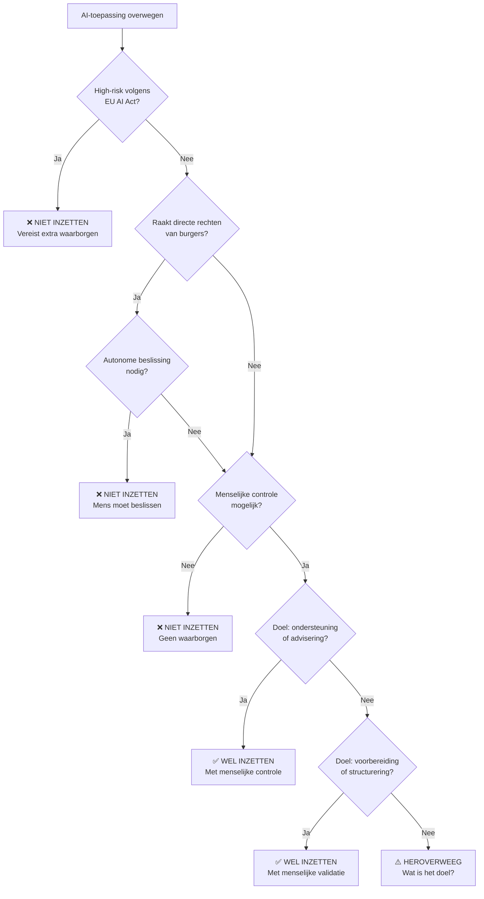

# AI en Praktijk: Handelingskaders en toepassing

:::info Platform AI en Overheid
Deze blog is geschreven in het kader van [Platform AI en Overheid](https://www.platformaienoverheid.nl/), een initiatief gericht op verantwoorde AI-adoptie binnen de publieke sector.
:::

AI kan de overheid efficiënter en menselijker maken, maar alleen als we het streng begrenzen met duidelijke handelingskaders. Stel je voor dat AI adviezen geeft voor subsidies of vergunningen – nuttig, maar hoe zorg je dat het binnen juridische en ethische grenzen blijft? Dit blog duikt in praktische toepassing, met voorbeelden, en scheidt wat AI mag (voorbereiden, adviseren) van wat niet (beslissen). Voor technische integratie, zie ons blog [AI en Techniek: Veilige integratie](/blog/ai-techniek-integratie).

<!--truncate-->

## De Uitdaging: AI Binnen Strakke Grenzen Houden

AI zonder grenzen is gevaarlijk – het kan biases versterken, privacy schenden of besluiten nemen die niemand begrijpt (zie ons blog ["AI en Werking: Wat is AI eigenlijk?"](/blog/ai-werking-bubbels) voor meer over hoe AI werkt en zijn beperkingen). De kernvraag is: wanneer zet je AI in, en wanneer niet? In de praktijk betekent dit een zorgvuldige balans tussen ondersteuning en controle, met altijd de mens als eindverantwoordelijke.[^10][^11] Want laten we eerlijk zijn, AI is slim, maar niet slim genoeg om je baas te zijn – de mens moet altijd de finale call maken.

Zonder duidelijke grenzen lopen we aanzienlijke risico's: AI kan oncontroleerbare adviezen genereren die moeilijk te valideren zijn, privacy-lekken veroorzaken zoals het incident in Eindhoven waar ambtenaren residentdata onbedoeld lekten via publieke AI-tools[^9], en juridische problemen opleveren die kunnen resulteren in boetes onder de AVG of de AI Act.[^4] Met heldere grenzen daarentegen waarborgen we transparantie in de werking van AI-systemen, behouden we controle over de processen en beslissingen, en bouwen we vertrouwen op bij burgers en medewerkers.[^2][^11]

## Wanneer AI Wel Inzetten: Ondersteunende Rollen met Praktijkvoorbeelden

AI is geschikt voor taken die ondersteunen, versnellen of verhelderen – altijd met menselijke controle. Neem bijvoorbeeld het structureren van burgeraanvragen: gemeenten ontvangen dagelijks honderden emails en formulieren met vragen over toeslagen, vergunningen en voorzieningen. AI kan deze berichten categoriseren, urgentie inschatten en automatisch naar de juiste afdeling routeren. Een ambtenaar ziet dan: "Burger vraagt om bijzondere bijstand, urgentie hoog, doorverwezen naar sociale zaken met samenvatting." De ambtenaar controleert en pakt het op – AI versnelt het proces, reduceert fouten, en maakt het werk overzichtelijker, zonder de verantwoordelijkheid over te nemen.[^1][^2]

Een ander toepassingsgebied is het ondersteunen bij patroonherkenning in geanonimiseerde data voor signalering van mogelijke onregelmatigheden. De VNG erkent dat AI kan helpen bij het signaleren van afwijkende patronen, maar benadrukt dat menselijke controle essentieel blijft: AI geeft een advies zoals "Dit patroon wijkt af van de norm – aanbevolen: nader onderzoek", waarna de ambtenaar het onderzoekt en besluit.[^2] Dit voorkomt discriminatie en houdt het ethisch verantwoord, in lijn met lessen uit het verleden zoals het SyRI-geval waar automatische profilering problematisch bleek.

## Wanneer AI Niet Inzetten: Kritieke Besluiten en Autonome Acties

We kunnen AI niet inzetten voor autonome besluiten of acties met directe impact – te riskant, juridisch onmogelijk.[^3][^10] Neem het voorbeeld van SyRI, het Nederlandse systeem voor fraudeopsporing dat in 2020 door de Rechtbank Den Haag verboden werd: het profileerde burgers te autonoom, zonder voldoende transparantie en inzichtelijkheid, en werd door de rechter in strijd verklaard met artikel 8 EVRM (recht op privéleven) vanwege mogelijke stigmatiserende en discriminerende effecten.[^5][^6] Les: geen AI die zelfstandig subsidies toekent, boetes oplegt of zorg toewijst – dat vereist menselijk oordeel voor nuances en verantwoordelijkheid.[^10][^11]

Ook bij persoonlijke situaties zoals uitkeringsbesluiten in gemeenten mag AI niet zelfstandig beslissen. AI kan wel patronen signaleren, maar het risico op fouten in complexe gevallen – denk aan medische uitzonderingen of bijzondere omstandigheden – is te groot. Het zou een slechte grap zijn als AI je uitkering afwijst omdat het je kat als 'afhankelijk familielid' ziet. Daarom is het cruciaal dat we AI niet inzetten wanneer het gaat om high-risk categorieën volgens de EU AI Act[^4], situaties waarin directe rechten van burgers worden geraakt[^3], of wanneer onvoorspelbaarheid kan leiden tot fouten met ernstige gevolgen.[^10] Ook privacy-lekken en juridische problemen liggen op de loer – we zien dit bijvoorbeeld bij de toenemende zorgen rondom databreuken door AI-chatbots in werkomgevingen, waarover de Autoriteit Persoonsgegevens heeft gewaarschuwd.[^7][^8]

## Juridische Duiding: Het Handelingskader van AI

Juridisch gezien mag AI in overheid geen handelingsbevoegdheid hebben – besluiten moeten herleidbaar zijn tot een menselijke ambtenaar ([artikel 1:3 Awb](https://wetten.overheid.nl/BWBR0005537/2025-01-01#Hoofdstuk1_Afdeling1.3_Artikel1:3) en [artikel 3:2 Awb](https://wetten.overheid.nl/BWBR0005537/2025-01-01#Hoofdstuk3_Afdeling3.1_Artikel3:2)).[^3] AI is dus tool, geen actor; het mag adviseren of voorbereiden, maar nooit bindende beslissingen nemen, rechten toekennen/ontzeggen of plichten opleggen. Dit voorkomt aansprakelijkheidskwesties – bij fouten moet altijd duidelijk zijn wie verantwoordelijk is – en waarborgt democratie door menselijke oversight en accountability te behouden.[^10][^11] In EU AI Act high-risk categorieën vereist dit expliciete menselijke oversight.[^4]

In de praktijk betekent dit dat AI altijd moet handelen binnen de supervisie van een natuurlijk persoon – een ambtenaar met een concrete rol en verantwoordelijkheid.[^3][^10] De AI-tool opereert als verlengstuk van die ambtenaar, niet als zelfstandige entiteit. Dit stelt echter wel specifieke eisen aan de technische infrastructuur: automatisering van rollen en rechten is hierbij essentieel.[^2] AI moet alleen toegang krijgen tot data waartoe de superviserende ambtenaar ook toegang heeft, en acties die AI voorstelt of voorbereid moeten expliciet geautoriseerd worden door die persoon.[^2][^11] Voor een diepgaande uitleg over hoe dit technisch vorm krijgt – denk aan autorisatielagen, datakoppelingen en metadata over herkomst en toegangsrechten – verwijzen we naar ons blog over [AI en Data: Waarom de datalaag alles bepaalt](/blog/ai-data-datalaag-basis). Zonder een goed ingerichte datalaag met heldere rollen en rechten, is verantwoorde AI-inzet in de overheid simpelweg niet mogelijk.

## AI als Ondersteunende Tool: Samenvatten, Genereren, Structureren – Met Menselijke Controle

AI mag in overheid ondersteunen, niet leiden. Een belangrijk toepassingsgebied is het samenvatten van lange dossiers tot kernpunten – denk aan een 200-pagina rapport dat AI reduceert tot een overzichtelijke twee pagina's met highlights, zodat de ambtenaar snel de essentie grijpt en vervolgens de relevante details kan controleren.[^1][^2] Daarnaast kan AI helpen bij het genereren van conceptbrieven en adviezen: bijvoorbeeld een standaardbrief voor kwijtschelding, waarbij AI een draft maakt met placeholders voor persoonlijke informatie, waarna de ambtenaar deze aanpast, nuance toevoegt en verstuurt.[^2] Ook bij het structureren van ongestructureerde data biedt AI meerwaarde – een warrige burgeremail vol vragen kan door AI worden geparsed om essentiële informatie zoals naam, BSN en urgentie te extraheren, waarna het bericht automatisch naar de juiste afdeling wordt gerouteerd.[^1]

Cruciaal bij al deze toepassingen is dat er altijd menselijke controle blijft: de ambtenaar checkt de output, past waar nodig aan, en neemt uiteindelijk de beslissing.[^10][^12] AI versnelt het proces, terwijl de mens de accuraatheid en ethische afwegingen waarborgt. De rode lijn is helder: AI mag nooit autonoom opereren door zelfstandig besluiten te nemen, overboekingen uit te voeren of wijzigingen door te voeren.[^3][^11] Menselijke controle is niet optioneel, maar verplicht.[^4][^10]

## Human in the Loop: De Mens Blijft Centraal

Human in the Loop (HITL) is cruciaal: menselijke oversight in AI-processen.[^12] In overheid betekent dit: AI adviseert of prepareert, maar mens controleert, beslist. Voorbeeld: AI genereert subsidie-advies, ambtenaar valideert – voorkomt fouten, biases, waarborgt ethiek. HITL houdt AI accountable, past bij democratische waarden en AI Act.[^4]

## Ethische Handelingsbevoegdheid: Mens Centraal

Techniek alleen volstaat niet – ethiek is essentieel voor verantwoorde AI-inzet. Verantwoord gebruik van AI betekent dat het werk versnelt, tikfouten voorkomt, vergeten checks opvangt en informatie toegankelijker maakt, waarbij de mens altijd eindverantwoordelijk blijft.[^10] Problematisch wordt het wanneer AI het menselijk oordeel vervangt, discrimineert (zelfs als dit "statistisch klopt"), of een gevoel van machteloosheid bij burgers creëert.[^10]

Het voorbeeld van SyRI illustreert dit perfect: het systeem werd verboden omdat het als black box opereerde, discriminatierisico's met zich meebracht en disproportioneel was in zijn inbreuk op privacy.[^5][^6] De les is duidelijk: AI-systemen moeten transparant, uitlegbaar en proportioneel zijn.[^4][^10] Dit vertaalt zich naar concrete ethische kaders: transparantie betekent dat burgers weten wanneer AI wordt gebruikt, proportionaliteit vereist dat de inzet evenredig is aan het doel, menselijke controle moet altijd gewaarborgd zijn, en non-discriminatie moet worden geborgd door actieve bias-testing en monitoring.[^10][^11]

## Beslisboom: Wanneer AI Wel of Niet Inzetten

Om het handelingskader visueel te maken, volgt hieronder een beslisboom die helpt bepalen of AI ingezet kan worden:

**Leeswijzer beslisboom:**

- ✅ = AI mag ingezet worden met de genoemde waarborgen
- ❌ = AI mag NIET ingezet worden
- ⚠️ = Heroverweeg het doel en de toepassing

## Conclusie

De inzet van AI in de overheid vraagt om een zorgvuldige balans tussen innovatie en verantwoordelijkheid.[^10][^11] Een goed ingericht AI-systeem vergroot de bestaanszekerheid van burgers en maakt de overheid toegankelijker – het is geen technologie die de bureaucratie opblaast, maar juist een middel om processen te versnellen en menselijker te maken.[^1][^2] Maar dat kan alleen als we strikte handelingskaders hanteren.

Die handelingskaders bestaan uit drie pijlers: praktische waarborgen die ervoor zorgen dat AI daadwerkelijk ondersteunt zonder over te nemen[^2], juridische kaders die helder maken dat AI nooit zelfstandig bevoegdheden mag uitoefenen maar altijd herleidbaar moet zijn tot een menselijke ambtenaar[^3], en ethische grenzen die waarborgen dat de mens beslist en discriminatie wordt voorkomen.[^10] De kernboodschap blijft helder: AI bereidt voor en adviseert, maar de mens neemt de beslissing en draagt de verantwoordelijkheid.[^11][^12]

Met deze waarborgen kunnen we de overheid effectiever en menselijker maken, zonder concessies te doen aan veiligheid, privacy of democratische waarden.[^4][^10][^11] AI wordt zo een tool die de ambtenaar ondersteunt bij complexe taken, burgers sneller helpt, en tegelijkertijd de menselijke controle en verantwoordelijkheid borgt. Dat is de enige manier waarop AI in de publieke sector kan bijdragen aan een rechtvaardige en transparante samenleving.

## Componenten

Hieronder verwijzingen naar toepasbare EuroStack-componenten en gerelateerde open source tools die verantwoorde AI-inzet ondersteunen:

- **SovereignAI**: AI-as-a-Service voor soevereiniteit – ideaal voor on-premise models die binnen handelingskaders opereren.
- **DataCommons**: Federated data exchange – voor veilige data-ophaal met rollen en rechten.
- **EuroOS**: Open source OS voor infrastructuur – basis voor veilige AI-omgevingen.
- **Ollama**: Tool voor lokale AI-inference – draai modellen on-premise zonder cloud, voorkomt datalekken.
- **Hugging Face**: Platform voor modeldownload en hosting – repositories voor on-premise deploy met volledige controle.
- **n8n**: Open source workflow automation tool – voor snelle business logica met menselijke controle.
- **Flowable**: Open source DMN/BPMN engine – opvolger Camunda, geschikt voor complexe processen met Human in the Loop.

Deze componenten en tools passen perfect bij veilige, soevereine AI-integratie binnen de juridische en ethische kaders van de overheid.

[^1]: **VNG** - [Position paper: AI, Algoritmen en Gemeenten](https://vng.nl/sites/default/files/2025-03/position-paper-ai-algoritmen-en-gemeenten.pdf)

- [^2]: **VNG** - [AI Governancekader voor gemeenten](https://aigovernance.vng.nl/)
- [^3]: **Rijksoverheid** - [Algemene wet bestuursrecht (Awb)](https://wetten.overheid.nl/BWBR0005537/2025-01-01)
- [^4]: **EU AI Act** - [High-risk AI en transparantie](https://artificialintelligenceact.eu/)
- [^5]: **Rechtbank Den Haag** - [SyRI-wetgeving in strijd met het Europees Verdrag voor de Rechten van de Mens](https://www.rechtspraak.nl/Organisatie-en-contact/Organisatie/Rechtbanken/Rechtbank-Den-Haag/Nieuws/Paginas/SyRI-wetgeving-in-strijd-met-het-Europees-Verdrag-voor-de-Rechten-voor-de-Mens.aspx)
- [^6]: **Gemeente.nu** - [Rechtbank: SyRI schendt privacy burgers](https://www.gemeente.nu/bedrijfsvoering/ai/rechtbank-syri-schendt-privacy-burgers/)
- [^7]: **Autoriteit Persoonsgegevens** - [Boete Clearview AI voor illegaal verwerken van biometrische gegevens](https://autoriteitpersoonsgegevens.nl/nl/nieuws/ap-boete-clearview-ai-voor-illegaal-verwerken-van-biometrische-gegevens)
- [^8]: **Autoriteit Persoonsgegevens** - [Aan de slag met AI-geletterdheid](https://autoriteitpersoonsgegevens.nl/documenten/aan-de-slag-met-ai-geletterdheid)
- [^9]: **Gemeente Eindhoven** - [Datalek openbare AI in Eindhoven](https://www.eindhoven.nl/nieuws/datalek-openbare-ai-in-eindhoven)
- [^10]: **Rathenau Instituut** - [Zo brengen we AI in de praktijk vanuit Europese waarden](https://www.rathenau.nl/sites/default/files/inline-files/Zo%20brengen%20we%20AI%20in%20de%20praktijk%20vanuit%20Europese%20waarden%20-%20Roos%20de%20Jong%2C%20Linda%20Kool%20en%20Rinie%20van%20Est.pdf)
- [^11]: **Rijksoverheid** - [Kabinet presenteert visie op generatieve AI](https://www.rijksoverheid.nl/actueel/nieuws/2024/01/18/kabinet-presenteert-visie-op-generatieve-ai)
- [^12]: **Chiodo, M. et al.** - [Formalising Human-in-the-Loop: Computational Reductions, Failure Modes, and Legal-Moral Responsibility](https://arxiv.org/abs/2505.10426)
