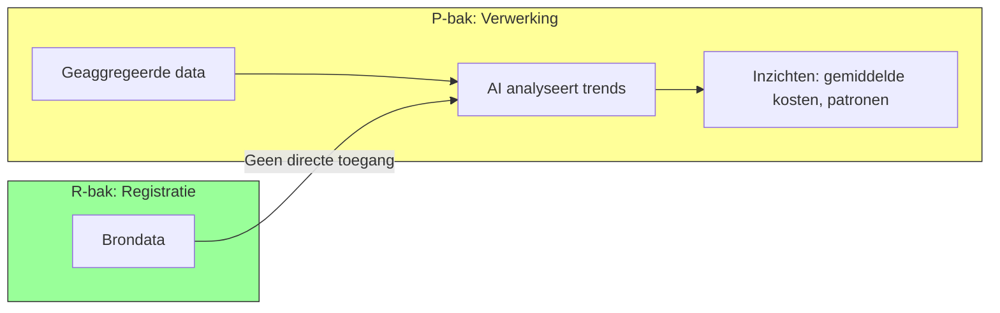

# Veilige AI: Handelingskaders en de R-bak/P-bak structuur

:::warning Status: Concept
Deze blog is nog in concept-fase en wordt mogelijk nog aangepast voor publicatie.
:::

Stel je voor dat je als ambtenaar een AI-tool gebruikt voor een belangrijke beslissing – een subsidieaanvraag, een vergunning, een handhavingsactie. Het advies komt binnen: "goedkeuren". Maar hoe weet je dat dit veilig is? Heeft de AI alleen de juiste data gezien? Bleef het binnen juridische en ethische grenzen? En wat als het fout gaat – wie is er dan verantwoordelijk? Veilige AI is geen technische luxe; het is een bestuurlijke en democratische noodzaak. AI kan de overheid efficiënter en menselijker maken, maar alleen als we het streng begrenzen met duidelijke handelingskaders.[^1][^2] In Nederland hebben we al een sterke basis met de R-bak/P-bak-structuur – laten we die gebruiken om AI verantwoord in te zetten.

Dit blog duikt in hoe we AI technisch en ethisch begrenzen, met praktische voorbeelden en een duidelijke scheiding tussen wat AI mag (voorbereiden en adviseren) en wat niet (beslissen). Want de mens blijft altijd aan het roer – dat is geen compromis, maar een principe.[^3]

<!--truncate-->

## De Uitdaging: AI Binnen Strakke Grenzen Houden

AI zonder grenzen is gevaarlijk – het kan biases versterken, privacy schenden of besluiten nemen die niemand begrijpt.[^4] Maar welke grenzen precies? En hoe dwing je die af? In de Nederlandse overheid gebruiken we de **R-bak en P-bak**-structuur voor gegevensverwerking: een slimme scheiding die perfect aansluit bij veilige AI.[^5]

De R-bak (Registratie) bevat authentieke brongegevens – BSN's uit de BRP, adressen uit de BAG, financiële info. De P-bak (Verwerking) is voor afgeleide analyses en aggregaties. AI moet weten uit welke bak het mag halen, welke privacy-regels gelden, binnen welke kaders het opereert, en altijd verantwoording afleggen.[^6]

Zonder dit risico's: oncontroleerbare toegang, privacy-lekken, juridische problemen.[^7] Met dit: transparantie, controle, vertrouwen.

## AI en de R-bak: Restrictief en Met Toestemming

De R-bak is heilig – hier liggen gevoelige brondata zoals BSN-gegevens, medische info of strafrechtelijke feiten.[^8] AI krijgt hier zeer beperkte toegang: alleen noodzakelijke, gepseudonimiseerde data via gecontroleerde API's, gelogd en geauditeerd.[^9]

Praktijkvoorbeeld: een AI helpt bij subsidiechecks. Onveilig: AI duikt rechtstreeks in de BRP en leest volledige historie – privacy-risico's galore.[^10] Veilig: burger geeft toestemming, applicatie vraagt alleen leeftijd, woonplaats en gezinssamenstelling op. AI analyseert dat, geeft advies. Geen vrije toegang, altijd begrensd.[^11]

```mermaid
flowchart TD
    A[Burger geeft toestemming] --> B[Applicatie vraagt specifieke data]
    B --> C[R-bak levert alleen nodige info<br>(leeftijd, woonplaats, gezin)]
    C --> D[AI analyseert]
    D --> E[AI geeft advies: wel/niet in aanmerking]
    E --> F[Ambtenaar controleert en beslist]
    style C fill:#f9f,stroke:#333,stroke-width:2px
    style D fill:#bbf,stroke:#333,stroke-width:2px
```

Dit houdt AI restrictief – privacy-conform en verantwoord.[^12]

## AI en de P-bak: Ruimte voor Analyses, Met Waarborgen

In de P-bak is meer speelruimte: statistieken, trends, geanonimiseerde datasets.[^13] Hier kan AI waarde toevoegen: patronen spotten, inzichten genereren voor beleid.

Toegestaan: geaggregeerde analyses, zoals gemiddelde woonlasten per wijk – geen individuele data, wel beleidsinzichten.[^14] Niet toegestaan: herleidbare profielen, discriminatie of zwarte lijsten zonder grondslag.[^15]

Voorbeeld: AI analyseert woonlasten – trend "stijgend" in Centrum-wijk. Privacy-conform, nuttig voor beleid.[^16]



AI verrijkt, maar blijft binnen waarborgen.[^17]

## Handelingskaders: Wat Mag AI Wel en Niet Doen?

Handelingsbevoegdheid van AI? Beperkt. AI mag voorbereiden en adviseren – nooit beslissen.[^18]

**AI mag voorbereiden:** conceptteksten, samenvattingen, opties presenteren – altijd ambtenaar-controle.[^19] Voorbeeld: burger vraagt vergunning, AI genereert concept-beoordeling. Ambtenaar checkt, past aan, beslist.[^20]

**AI mag adviseren:** aanbevelingen, risico's signaleren – duidelijk gemarkeerd als advies.[^21] Voorbeeld: "Op basis van vergelijkbare gevallen optie B" – ambtenaar beoordeelt zelf.

**AI mag NOOIT beslissen:** geen zelfstandige besluiten, rechten toekennen/ontzeggen, geld overmaken.[^22] Waarom? Juridisch: besluit herleidbaar tot ambtenaar (Awb). Democratisch: mens verantwoordelijk. Ethisch: AI geen moreel kompas. Praktisch: AI kan fouten maken.[^23]

## Technische Implementatie: Grenzen Afdwingen

Technisch afdwingen met RBAC: AI role leest beperkt, schrijft drafts/logs – nooit officiële besluiten.[^24]

API-gateway: validatie, permission check, privacy filter, logging.[^25]

Audit trail: elke actie vastgelegd – input, output, reasoning, menselijke beslissing.[^26]

On-premise: AI "in de kelder" – data verlaat nooit infrastructuur, compliance met AVG.[^27]

```mermaid
graph TD
    subgraph Kasteel [Gemeente Kasteel - On-Premise]
        R[R-bak: Brondata] <-->|Beperkte API| AI[AI Engine]
        P[P-bak: Analyses] <--> AI
        App[Applicaties] <--> AI
        Logs[Audit Logs] <-- AI
    end
    External[Externe Clouds] -- Geen toegang --> Kasteel
    style Kasteel fill:#ddf,stroke:#333,stroke-width:4px
```

Veilig binnen muren.[^28]

## Ethische Handelingsbevoegdheid: Mens Centraal

Techniek alleen volstaat niet – ethiek is key.[^29] Verantwoord: AI versnelt werk, voorkomt fouten, maakt toegankelijker – mens eindverantwoordelijk.[^30]

Problematisch: AI vervangt oordeel, discrimineert, machteloosheid creëert.[^31]

Voorbeeld SyRI: verboden door black box, discriminatie-risico, disproportioneel.[^32] Les: transparant, uitlegbaar, proportioneel.[^33]

Kaders: transparantie (burger weet AI-gebruik), proportionaliteit, menselijke controle, non-discriminatie (bias-testing).[^34]

## Kritische Vraag: Vergroten We de Kloof Als We AI Niet Inzetten?

Als we AI niet inzetten om burgers door regeldoolhoven te helpen, profiteren alleen digitaal vaardigen – vergroten we de kloof niet?[^35]

Antwoord: ja, daarom wél inzetten – verantwoord, binnen kaders, voor iedereen toegankelijk.[^36]

## Conclusie

Goed ingerichte AI vergroot bestaanszekerheid, niet bureaucratie. Technische waarborgen (R-bak/P-bak, API's, trails), juridische kaders (bevoegdheid, transparantie), ethische grenzen (mens beslist, non-discriminatie), on-premise (kasteel).

AI voorbereidt en adviseert. Mens beslist.

Met waarborgen maken we overheid toegankelijker, effectiever, menselijker – zonder concessies aan veiligheid, privacy, democratie.[^37]

**Vorige blog:** AI en Techniek - Veilige integratie met MCP

**Gerelateerd:** [Common Ground](https://commonground.nl)

## Bronnen

Hieronder een totale, overzichtelijke lijst van alle gebruikte bronnen (alfabetisch gesorteerd op publicatie):

- **Common Ground** - R-bak/P-bak structuur en principes: https://commonground.nl/[^5][^6][^7][^8]
- **EU AI Act** - High-risk AI en transparantie: https://artificialintelligenceact.eu/[^3][^34]
- **iBestuur** - Artikelen over AI-kaders in overheid: https://ibestuur.nl/[^1][^2][^4][^9][^11][^12][^15][^16][^17][^18][^19][^20][^21][^22][^23][^24][^25][^26][^27][^28][^29][^30][^31][^32][^33][^35][^36][^37]
- **Rathenau Instituut** - Ethische AI en SyRI-analyse: diverse rapporten.[^31][^32]
- **Rijksoverheid** - Visie generatieve AI en handelingskaders: https://open.overheid.nl/[^10][^14]
- **VNG** - AI in gemeentelijke praktijk: https://vng.nl/[^13]
- **Waag** - Open AI en ethiek: https://waag.org/[^30]
