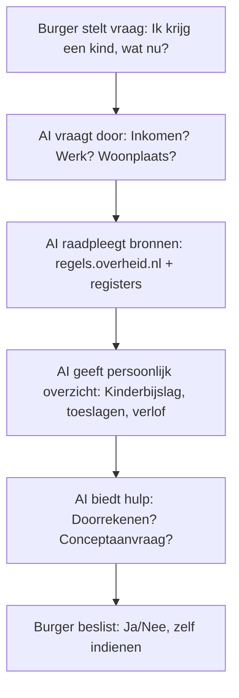

# AI en kansen voor Burgers: De begrijpenlijke overheid

:::warning Concept
Dit blog is nog in concept fase en niet geschickt voor publicatie
:::

:::info Platform AI en Overheid
Deze blog is geschreven in het kader van [Platform AI en Overheid](https://www.platformaienoverheid.nl/), een initiatief gericht op verantwoorde AI-adoptie binnen de publieke sector.
:::

De Nederlandse regelgeving is een jungle: landelijk, provinciaal, gemeentelijk, constant veranderend, vol voorwaarden en uitzonderingen.[^3] Veel burgers missen regelingen waar ze recht op hebben, of haken af door complexiteit.[^4] AI kan hier de gids zijn – de Regelgeving Navigator die burgers helpt door de wirwar heen.[^1][^2] Dit is geen luxe, maar een kans om bestaanszekerheid te vergroten en de kloof tussen overheid en burger te verkleinen.[^4][^6]

Maar stel je voor dat je als burger een vraag hebt over toeslagen, vergunningen of subsidies. Je opent een app of belt een nummer, en in plaats van uren zoeken op websites of wachten aan de telefoon, krijg je direct een helder, persoonlijk antwoord – in begrijpelijke taal, met stappenplan en doorrekeningen. Geen juridisch jargon, geen "lees artikel 12.3 van wet X", maar gewoon: "Op basis van jouw situatie kom je waarschijnlijk in aanmerking voor huurtoeslag van ongeveer €200 per maand. Wil je dat ik het doorreken?" Dat is geen verre toekomst. Dat is wat AI nú al mogelijk maakt voor de overheid – als we het goed inrichten.[^1][^2] Niet om ambtenaren te vervangen, maar om de overheid toegankelijker én eerlijker te maken voor iedereen.[^6]

<!--truncate-->

## Het Probleem: De Regelgeving-Jungle Die Burgers Verdwaald Laat

Nederland heeft een prachtig stelsel van rechten en plichten, maar het is ook ongelooflijk complex. Nationale wetten overlappen met provinciale regels, gemeentelijke verordeningen en waterschapsbesluiten.[^3] Alles verandert continu: nieuwe subsidies, aangepaste voorwaarden, tijdelijke maatregelen. En dan de taal: juridisch jargon, verwijzingen naar andere artikelen, labyrinten van "indien... dan... tenzij".[^3]

Resultaat? Burgers raken verdwaald. Ze missen toeslagen, weten niet waar ze recht op hebben, of geven op door frustratie.[^4] Laaggeletterden, niet-Nederlands sprekenden, digitaal minder vaardigen en ouderen worden het hardst geraakt – de kloof groeit.[^4] De overheid wil toegankelijk zijn, maar zonder slimme hulp blijft het een doolhof.[^6]

## De Kans: AI als Persoonlijke Wegwijzer Door de Jungle

AI kan hier een doorbraak zijn – niet door te automatiseren, maar door te verhelderen en te begeleiden.[^1][^6] Stel een Regelgeving Navigator: een AI die burgers helpt met persoonlijke situaties, in begrijpelijke taal, met pro-actieve suggesties.[^2]

Neem een jonge ouder: "Mijn partner en ik krijgen een kind. Wat komt op ons af?" AI doorloopt: kinderbijslag (automatisch), opvangtoeslag (doorrekenen?), geboorteverlof, gemeentelijke pakketten – stap voor stap, met vragen om details.[^1][^2]

Of een startende zzp'er: "Ik begin een eenmanszaak, waar moet ik aan denken?" AI: KvK, BTW, mogelijke subsidies, pensioenvalkuilen – overzichtelijk, zonder overload.[^2]

AI vertaalt ambtelijk naar alledaags: "Je verzamelinkomen overschrijdt de vermogenstoets niet" wordt "Je inkomen en spaargeld blijven onder de grens, dus je komt in aanmerking."[^1] Het vraagt door, rekent scenario's door, bereidt conceptaanvragen voor – altijd met burger in controle.[^6][^7]

Dit bouwt voort op bestaande bronnen: regels.overheid.nl (machine-leesbaar), MijnOverheid, Common Ground-registers.[^3][^5] AI raadpleegt ze, legt uit, verwijst naar officiële tekst – transparant en betrouwbaar.[^1][^2]

AI ondersteunt, burger beslist – mens blijft centraal.[^6][^7]

## Praktijkvoorbeelden: Hoe Het Leven Makkelijker Maakt

Laten we het concreet maken met verhalen.

**De jonge ouder Mark:** Partner zwanger, onzeker over financiën. AI: "Gefeliciteerd! Kinderbijslag automatisch €250/kwartaal. Opvangtoeslag tot €1600/maand als jullie werken – wil je doorrekenen?" Mark geeft info, AI berekent, wijst op gemeentelijke baby-box. Geen zoektocht, direct overzicht – minder stress in spannende tijd.[^1][^2]

**Startende Sara (zzp'er):** "Ik begin als zelfstandige." AI: Verplichte stappen (KvK, BTW), mogelijke voordelen (startersaftrek, lening), valkuilen (pensioen). Sara: "Wat als ik parttime blijf?" AI rekent door. Sara start zelfverzekerd, mist niets.[^2]

**Senior Ans (70):** "Ik red het niet meer alleen." AI: WMO-hulp, wijkverpleging, eigen bijdrage berekenen. "Eerste stap: bel loket." Ans voelt zich gehoord, niet overweldigd.[^2]

Deze voorbeelden tonen: AI maakt overheid menselijker – toegankelijker voor laaggeletterden, nieuwkomers, ouderen.[^4][^6]

## Ondersteunen, Niet Vervangen: Mens Altijd in Controle

Cruciaal: AI ondersteunt, beslist nooit.[^6][^7] Het bereidt conceptaanvragen voor, vult velden (met toestemming), berekent bedragen – burger controleert, dient in.[^1][^2] Geen automatisch indienen, tekenen, verplichten.[^7] Ambtenaar beslist bij behandeling.[^2]

Waarborgen: expliciete toestemming data, transparantie gebruik, opt-in, recht op menselijke bediening.[^7][^8] Meerdere kanalen: app, telefoon, balie – geen digitale kloof.[^4][^6]

## De Infrastructuur: Bouwen op Wat Er Is

Dit bouwt op bestaande pijlers: regels.overheid.nl (machine-leesbaar), Common Ground-registers (betrouwbare data), MijnOverheid-integratie.[^3][^5] On-premise AI, privacy by design – data veilig in Nederland.[^1][^8]

Consent management: burger bepaalt delen, altijd revokeerbaar.[^8]

## De Toegevoegde Waarde: Voor Burgers én Overheid

Voor burgers: niemand mist rechten, minder stress, tijdsbesparing, betere beslissingen – bestaanszekerheid groeit.[^4][^6]

Voor overheid: beter bereik (inclusief kwetsbare groepen), minder verspilling (juiste aanvragen), inzichten in knelpunten (welke regels onduidelijk?).[^2] Menselijker imago: toegankelijk, responsief.[^1][^6]

## Kritische Kanttekening: Risico's Mitigeren

Risico digitale ongelijkheid? Meerdere kanalen, extra ondersteuning.[^4][^6] Privacyzorgen? Transparantie, consent, geen delen zonder toestemming.[^7][^8] Overafhankelijkheid? AI hulpmiddel, documentatie blijft.[^1]

## Conclusie

AI kan kloof tussen burger en overheid verkleinen – door taalbarrière te doorbreken, kennis toegankelijk te maken, processen te vereenvoudigen.[^1][^6]

Goed gedaan: met waarborgen privacy, mens controle, meerdere kanalen, transparantie.[^7][^8]

Techniek bestaat, data is er.[^3][^5] Keuze om te bouwen.

Vraag niet óf, maar hoe snel. Elke burger die nu regelingen mist, is er één te veel.[^4]

**Volgende blog:** Risico's van Niet-Adopteren - Waarom de overheid AI niet kan negeren

**Gerelateerd:** [Regels.overheid.nl](https://regels.overheid.nl) | [MijnOverheid](https://mijn.overheid.nl)

[^1]: **Rijksoverheid** - [Kabinet presenteert visie op generatieve AI](https://www.rijksoverheid.nl/actueel/nieuws/2024/01/18/kabinet-presenteert-visie-op-generatieve-ai)

[^2]: **VNG** - [AI Governancekader voor gemeenten](https://aigovernance.vng.nl/)

[^3]: **Regels.overheid.nl** - [Over machine-leesbare regelgeving](https://regels.overheid.nl/home)

[^4]: **SCP** - [Digitale ongelijkheid in Nederland](https://www.scp.nl/publicaties/publicaties/2021/10/07/digitale-ongelijkheid-in-nederland)

[^5]: **Common Ground** - [Architectuur en principes](https://commonground.nl/)

[^6]: **Rathenau Instituut** - [Zo brengen we AI in de praktijk vanuit Europese waarden](https://www.rathenau.nl/sites/default/files/inline-files/Zo%20brengen%20we%20AI%20in%20de%20praktijk%20vanuit%20Europese%20waarden%20-%20Roos%20de%20Jong%2C%20Linda%20Kool%20en%20Rinie%20van%20Est.pdf)

[^7]: **EU AI Act** - [High-risk AI en transparantie](https://artificialintelligenceact.eu/)

[^8]: **Autoriteit Persoonsgegevens** - [Aan de slag met AI-geletterdheid](https://autoriteitpersoonsgegevens.nl/documenten/aan-de-slag-met-ai-geletterdheid)
